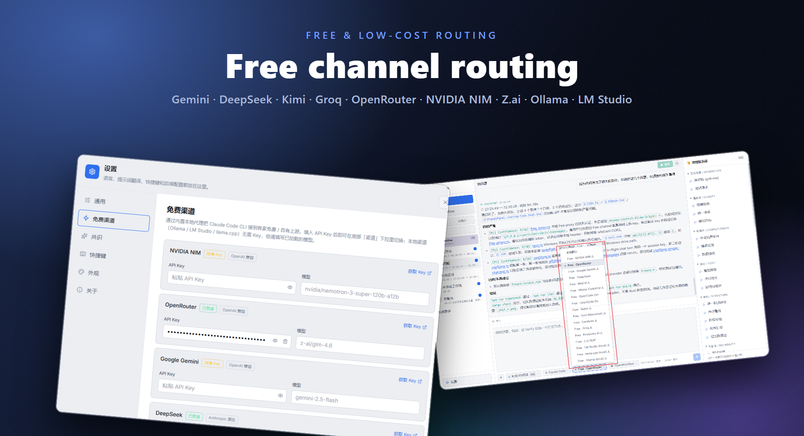
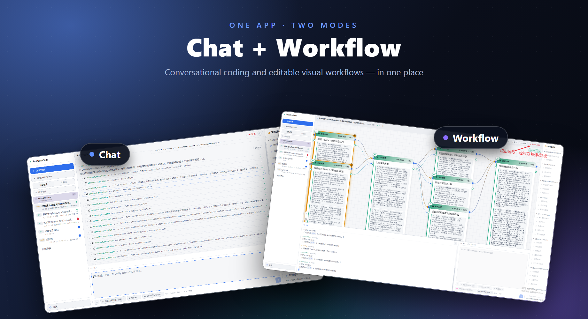

<p align="center">
  
</p>

<h1 align="center">FreeUltraCode</h1>

<h3 align="center">Use free and low-cost models as dynamic coding workflows.</h3>

<p align="center">
  FreeUltraCode is a local desktop coding tool that combines free-model routing with editable Dynamic Workflows. It turns cheap and free models into multi-agent flows that research, generate, challenge, vote, and retry so difficult programming tasks can get higher accuracy without sending every step to the most expensive model.
</p>

<p align="center">
  <strong>English</strong>
  &nbsp;·&nbsp;
  <a href="app/doc/README.zh-CN.md">中文</a>
  &nbsp;·&nbsp;
  <a href="app/doc/README.fr.md">Français</a>
  &nbsp;·&nbsp;
  <a href="app/doc/README.de.md">Deutsch</a>
  &nbsp;·&nbsp;
  <a href="app/doc/README.es.md">Español</a>
  &nbsp;·&nbsp;
  <a href="app/doc/README.pt-BR.md">Português</a>
  &nbsp;·&nbsp;
  <a href="app/doc/README.ru.md">Русский</a>
  &nbsp;·&nbsp;
  <a href="app/doc/README.ja.md">日本語</a>
  &nbsp;·&nbsp;
  <a href="app/doc/README.ko.md">한국어</a>
  &nbsp;·&nbsp;
  <a href="app/doc/README.hi.md">हिन्दी</a>
  &nbsp;·&nbsp;
  <a href="app/doc/README.ar.md">العربية</a>
  &nbsp;·&nbsp;
  <strong><a href="https://discord.gg/2C9ptSEFG">Discord</a></strong>
  &nbsp;·&nbsp;
  <strong>QQ Group: 149523963</strong>
</p>

<p align="center">
  <a href="app/package.json"></a>
  <a href="app/src-tauri/tauri.conf.json"></a>
  <a href="app/package.json"></a>
  <a href="app/package.json"></a>
  <a href="app/package.json"></a>
  <a href="https://discord.gg/2C9ptSEFG"></a>
  
</p>

<p align="center">
  <strong>Free channel routing</strong><br>
  
</p>

<p align="center">
  <strong>Two modes — Chat &amp; Workflow</strong><br>
  
</p>

> [!IMPORTANT]
> **Community · 加入社区** — join the FreeUltraCode Discord or QQ group for setup help, workflow examples, feature ideas, and contributor coordination. Discord: <https://discord.gg/2C9ptSEFG> · QQ Group: `149523963`

## Why FreeUltraCode

Modern coding agents become much more reliable when they do not answer once and stop. Dynamic Workflows improve output quality by splitting a request into multiple agents, exploring from different angles, validating adversarially, and voting over competing answers. The tradeoff is cost: a serious workflow can burn through premium-model quota quickly.

FreeUltraCode makes that pattern visible, editable, and cheaper:

- Use free or low-cost channels such as Gemini, DeepSeek, Kimi, Groq, OpenRouter, NVIDIA NIM, Z.ai, Ollama, LM Studio, and llama.cpp.
- Fan out only the steps that need extra certainty; keep simple steps as single-pass calls.
- Let critical coding tasks pass through multi-angle research, adversarial review, tournament selection, or self-consistency voting.
- Route different nodes to different runtimes and model tiers, so expensive models are reserved for judgment, review, or high-risk steps.
- Keep the whole workflow graph local, inspectable, exportable, and reusable.

FreeUltraCode is not just a chat UI. It is a way to turn a collection of cheap models into a structured programming workflow.

## What It Can Do

### Free-Model Coding Chat

- **17+ built-in channels**: NVIDIA NIM, OpenRouter, Google Gemini, DeepSeek, Mistral, Mistral Codestral, Groq, Cerebras, Fireworks, Kimi, Z.ai, OpenCode, Wafer, plus local runtimes such as Ollama, LM Studio, and llama.cpp.
- Local Rust proxy translates between Anthropic and OpenAI-compatible protocols, so the same interface can talk to different providers.
- API keys stay on your machine. Local runtimes can run with zero API keys.

### Dynamic Workflow Canvas

- Generate an editable workflow blueprint from a natural-language coding goal.
- Build agent steps, parallel branches, pipelines, loops, branches, consensus nodes, and reusable composite workflows on a React Flow canvas.
- Compile the graph into runnable Claude Code-style workflow scripts, then parse scripts back into the same graph model.
- Run workflows from the desktop app while tracking node-level execution state.
- Export and import workflow graphs as portable `.fuc.json` files.

### Multi-Round Accuracy Loop

FreeUltraCode supports the quality patterns that make Dynamic Workflows useful for programming:

| Pattern | Use it for | What happens |
| --- | --- | --- |
| Multi-angle research | Ambiguous requirements, architecture, migrations | Several agents inspect the same goal from different lenses before generation. |
| Adversarial validation | Security, code review, risky refactors | Candidate answers are challenged and only conclusions that survive critique are kept. |
| Tournament selection | Competing implementation plans | Multiple plans are scored; the winner can absorb useful ideas from the others. |
| Self-consistency voting | Deterministic decisions and structured outputs | The same prompt runs multiple times and the majority answer is selected. |
| Adaptive escalation | Hard nodes and final verification | The runner can start with a small sample count, measure disagreement, and add more samples only when needed. |

### Runtime and Model Routing

- Use Claude Code, Codex, Gemini, or extensible provider routing.
- Configure model/provider choices globally or per node.
- Route Claude Code through free channels via the local proxy.
- Use cheaper models for discovery and stronger models for synthesis, review, or final judgment.

### Local-First Workspace

- Sessions, favorites, history, API keys, and workflow files are stored locally.
- Chat sessions and workflow sessions are both preserved in the sidebar history.
- No hosted FreeUltraCode server is required.

## Quick Start

Run the web app from `app/`:

```bash
cd app
npm install
npm run dev
```

Vite starts at <http://localhost:5173>.

Run the desktop app:

```bash
cd app
npm run desktop
```

Build a production desktop package:

```bash
cd app
npm run package
```

From the repository root, `run.bat` rebuilds when needed and launches the Windows app. `build.bat` packages the Windows installer.

## Basic Usage

### Register a Free Channel

1. Select **Claude Code** from the bottom runtime menu if you want Claude Code to route through a free channel.

<p align="center">
  
</p>

2. Open the channel menu and choose a channel with a warning mark, for example **Free · OpenRouter**.

<p align="center">
  
</p>

3. Click **Open registration site**, create an API key on the provider page, then paste it back into FreeUltraCode and click **Save and Use**.

<p align="center">
  
</p>

<p align="center">
  
</p>

<p align="center">
  
</p>

4. You can also manage every free channel from **Settings** → **Free Channels**. Channels marked **Ready** have the required configuration.

<p align="center">
  
</p>

After the channel is ready, use the bottom input to chat or run a workflow through that route. See the [free channel registration guide](app/doc/register-free-channel.md) for the full Chinese walkthrough.

### Use Chat for Programming

Chat mode is the fastest path for a single coding task: ask for the change, let FreeUltraCode inspect and edit the project, then review the command log and final result. Use Workflow mode when the task needs multiple agents, voting, or a reusable process.

1. Click **+ New Chat** in the left sidebar.
2. Choose the runtime, permission mode, and workspace from the bottom controls. For code edits, make sure the selected workspace is the repository you want to modify.
3. Describe the programming request with enough implementation context: target behavior, affected UI or files, acceptance criteria, and any constraints. Press `Ctrl+Enter` or click the send button.

<p align="center">
  
</p>

4. While the task is running, watch the message stream and command rows. FreeUltraCode shows file reads, searches, edits, checks, and tool calls as separate entries, so you can see what the agent is doing. Click **Stop** if the request is going in the wrong direction.

<p align="center">
  
</p>

5. After completion, review the summary, changed behavior, and verification commands. If the result needs adjustment, continue in the same chat with a follow-up request or use the right-side prompt shortcuts to clarify goals, boundaries, error handling, structure, cost, or reliability.
6. For UI changes, run the app and check the feature directly. In this example, the chat request adds a scheduled task dialog for favorites, then verifies the modal and saved weekly schedule.

<p align="center">
  
</p>

### Build a Coding Workflow

1. Click **+ New Workflow**.
2. Describe the programming task in the AI input: code review, migration, refactor plan, bug investigation, test generation, architecture audit, or implementation plan.
3. Let FreeUltraCode generate a blueprint, then refine it with follow-up instructions or right-panel prompt shortcuts for structure, completeness, cost, reliability, and rollback.
4. Select important nodes and configure prompt text, schema, model tier, provider, or execution parameters.
5. Convert high-risk nodes to **Consensus** when they need adversarial checking or voting.
6. Click **Run** and watch node-level status updates.

## CLI Preview

The CLI exposes two user-facing commands:

- `fuc gen` generates or modifies a workflow script from natural language.
- `fuc run` runs a workflow script, with dry-run and resume support.

Build it first if `app/cli/dist/fuc.mjs` does not exist:

```bash
cd app
npm run cli:build
```

Then run it from the repository root:

```bash
node app/cli/dist/fuc.mjs gen "Create a code-review workflow" -o review.js
node app/cli/dist/fuc.mjs run review.js --dry-run
```

See [FreeUltraCode CLI usage](app/doc/freeultracode-cli-usage.md) and the [CLI skill spec](app/doc/freeultracode-cli-skill-spec.md) for details.

## How It Works

`IRGraph` is the single source of truth. The canvas, parser, emitter, AI mutation path, runtime, and local persistence all operate on the same model-agnostic graph.

```text
Coding goal
    |
    +-- Chat mode ------> simpleBlueprint -> single-node IRGraph -> free-channel proxy -> answer
    |
    +-- Workflow mode --> multi-angle research -> blueprint consensus -> IRGraph -> React Flow canvas
                                                                       |
                                                                       +--> emitter -> runnable workflow script
                                                                       |
                                                                       +--> parser  -> round-trip graph recovery
                                                                       |
                                                                       +--> runtime -> Claude Code / Codex / Gemini
                                                                                     |
                                                                                     +--> consensus / vote / retry
```

Free-channel proxy:

- Runs locally and binds to `127.0.0.1:<port>`.
- Routes each channel through `http://127.0.0.1:<port>/ch/<channelId>`.
- Translates Anthropic and OpenAI-compatible streaming protocols.
- Lets Claude Code use non-Anthropic and local providers through the same gateway path.

## Technology Stack

| Area | Technology |
| --- | --- |
| Desktop shell | Tauri 2, Rust |
| Frontend | React 18, Vite 5, TypeScript 5 |
| Canvas | React Flow / `@xyflow/react` |
| State | Zustand |
| Styling | Tailwind CSS, CSS variables |
| Icons | lucide-react |
| Workflow core | `IRGraph`, parser, emitter, round-trip checks |
| Runtime | DAG execution, provider gateway, per-node status, consensus runner |
| Free-channel proxy | Rust `tiny_http` + `ureq`, Anthropic/OpenAI protocol translation |
| Runtime adapters | Claude Code, Codex, Gemini, extensible provider routing |

## Project Structure

```text
app/
  src/
    core/        IR, parser, emitter, fixtures, consensus heuristics, round-trip checks
    canvas/      React Flow projection, node components, toolbar
    panels/      Sidebar, prompt panel, AI dock, node inspector, settings
    runtime/     DAG execution, provider gateway, consensus, run state
    store/       Zustand state and history
    lib/
      freeChannels.ts  17+ free channel catalog + helpers
  src-tauri/
    src/
      free_proxy.rs    Rust reverse proxy + Anthropic/OpenAI translation
      lib.rs           Tauri commands, filesystem/history bridge
  doc/                 Tutorials, localized READMEs, CLI docs, screenshots
docs/                  Research notes, static docs, assets
pencil/                Pencil design files
```

## Documentation

- [Usage tutorial](app/doc/claude-code-workflow-freeultracode.en.md) - walkthrough from settings and AI input to blueprint generation, running, and appearance switching.
- [Chinese usage tutorial](app/doc/claude-code-workflow-freeultracode.md)
- [Free channel registration guide](app/doc/register-free-channel.md) - Chinese walkthrough for creating and saving a free-channel API key.
- [FreeUltraCode CLI usage](app/doc/freeultracode-cli-usage.md)
- [FreeUltraCode CLI skill spec](app/doc/freeultracode-cli-skill-spec.md)
- [Chinese README](app/doc/README.zh-CN.md)
- [Workflow syntax reference](docs/workflow-syntax-reference.html)

## Development

Useful commands from `app/`:

```bash
npm run dev        # Vite dev server
npm run typecheck  # TypeScript check without emitting files
npm run lint       # ESLint for .ts and .tsx files
npm run test       # Vitest suite
npm run desktop    # Tauri development mode
npm run package    # Production Tauri build
```

For parser, emitter, or IR changes, run the app and use the browser console helpers exposed on `window.FreeUltraCode`, especially:

```js
FreeUltraCode.roundtrip()
FreeUltraCode.roundtripAll()
```

## Community

- Discord: <https://discord.gg/2C9ptSEFG>
- QQ Group: `149523963`
- Issues: <https://github.com/wellingfeng/FreeUltraCode/issues>
- Repository: <https://github.com/wellingfeng/FreeUltraCode>

Pull requests should describe the behavior change, list verification commands, link related issues, and include screenshots or short recordings for UI changes.

## License

No license has been specified yet.
