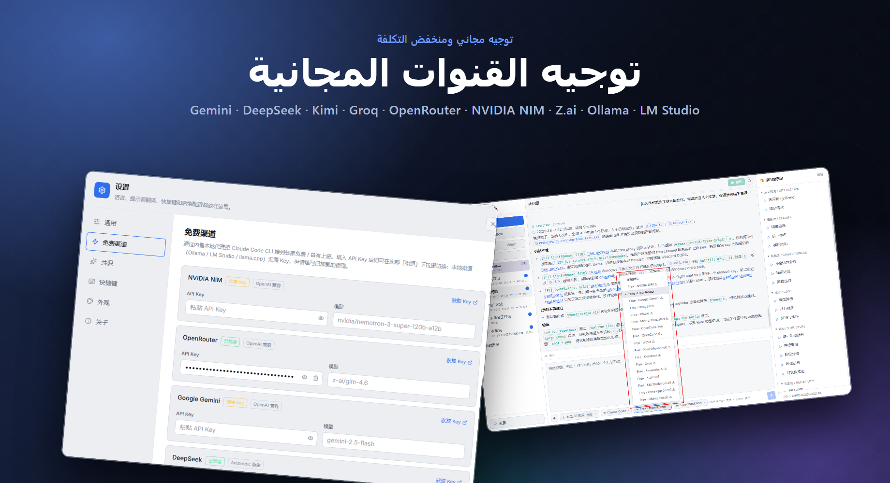
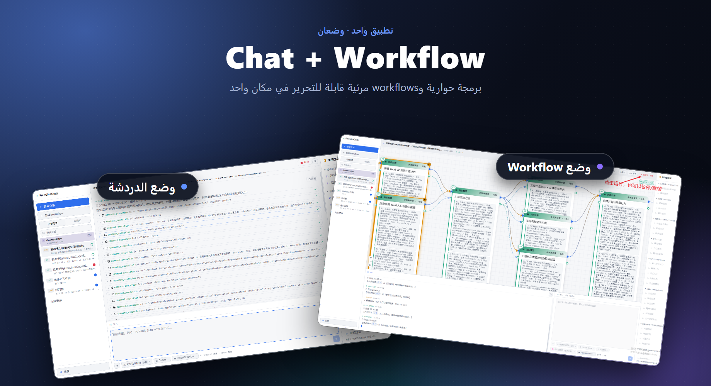

# FreeUltraCode

<div align="center">
  <a href="../../README.md">English</a> | <a href="README.zh-CN.md">中文</a> | <a href="README.fr.md">Français</a> | <a href="README.de.md">Deutsch</a> | <a href="README.es.md">Español</a> | <a href="README.pt-BR.md">Português</a> | <a href="README.ru.md">Русский</a> | <a href="README.ja.md">日本語</a> | <a href="README.ko.md">한국어</a> | <a href="README.hi.md">हिन्दी</a> | العربية
</div>

تطبيق FreeUltraCode لل سطح المكتب يجمع بين المحادثة المجانية مع النماذج الكبيرة والتحرير البصري لسير العمل متعدد الوكلاء. يمكنك التحدث مباشرة عبر 17+ قناة مجانية (Gemini، DeepSeek، Groq، Ollama…)، أو بناء رسوم بيانية لسير العمل على اللوحة وتحويلها إلى نصوص قابلة للتشغيل على Claude Code وCodex وGemini وبيئات تشغيل أخرى.

<p align="center">
  <strong>توجيه القنوات المجانية</strong><br>
  
</p>

<p align="center">
  <strong>وضعان: الدردشة وسير العمل</strong><br>
  
</p>

## الميزات الرئيسية

### 🧊 محادثة مجانية مع النماذج الكبيرة
- **17+ قناة مجانية** مدمجة — NVIDIA NIM، OpenRouter، Google Gemini، DeepSeek، Mistral، Groq، Cerebras، Fireworks، Kimi، Z.ai، OpenCode، Wafer، بالإضافة إلى بيئات تشغيل محلية (Ollama، LM Studio، llama.cpp).
- وكيل Rust مدمج يترجم بين بروتوكولات Anthropic وOpenAI، فتعمل جميع القنوات بنفس واجهة المحادثة.
- اختر قناة، الصق مفتاح API، وابدأ المحادثة — لا حاجة لضبط إضافي.
- بيئات التشغيل المحلية (Ollama، LM Studio، llama.cpp) تعمل **بدون أي مفتاح API**.

### 🕸️ تحرير بصري لسير العمل
- أدخل هدفك في حقل الذكاء الاصطناعي أسفل اليمين وولّد مخطط Workflow قابلًا للتحرير.
- تأليف بصري لسير العمل بدلاً من التحرير اليدوي لنصوص الوكلاء المتعددة الكبيرة.
- يحوّل المخطط إلى نصوص Workflow قابلة للتشغيل بأسلوب Claude Code، مع دعم العودة من النص إلى المخطط.
- اختر Claude Code، Codex، Gemini أو محوّلات إضافية، واضبط النموذج لكل عقدة.
- تشغيل/إيقاف من التطبيق مع تتبع حالة التنفيذ لكل عقدة.

### ⭐ المفضلة والتاريخ
- ضع نجمة على أي جلسة لتثبيتها في علامة **المفضلة** للوصول السريع.
- علامة **التاريخ** تعرض جميع الجلسات مع شارات: **CHAT** للمحادثات البسيطة، **WF** لجلسات سير العمل.
- تاريخ كامل للمساحات والجلسات — تغيير السياق دون فقدان التقدم.

### 🔒 الخصوصية أولاً
- مفتاح API يُحفظ فقط على جهازك، ولا يُرسل إلى أي خادم.
- جميع بيانات سير العمل والجلسات والإعدادات تبقى على جهازك.

## دليل الاستخدام

- [دليل استخدام FreeUltraCode](claude-code-workflow-freeultracode.ar.md) - شرح تفصيلي بالصور من الإعدادات العامة واختيار runtime في إدخال AI إلى إنشاء المخطط والتشغيل وتبديل المظهر.

## البدء السريع

```bash
cd app
npm install
npm run dev
```

لتطبيق سطح المكتب:

```bash
cd app
npm run desktop
```

لحزمة إصدار Windows:

```bash
cd app
npm run package
```

من جذر المستودع، يُشغّل `run.bat` التطبيق ويعيد بناءه عند الحاجة، ويحزم `build.bat` مُثبّت Windows.

## الاستخدام

### وضع المحادثة

1. انقر **+ جلسة جديدة** في الشريط الجانبي.
2. اختر قناة مجانية (مثلاً Gemini، DeepSeek، Ollama) أو استخدم مفتاح API الخاص بك مع أي بيئة تشغيل.
3. اكتب سؤالك في حقل الإدخال أسفل الشاشة. ستظهر الإجابة في منطقة المحادثة أعلاه.
4. ضع نجمة على الجلسة لتثبيتها في علامة **المفضلة**.

### وضع سير العمل

1. انقر **+ سير عمل جديد** في الشريط الجانبي.
2. صِف المهمة في حقل إدخال الذكاء الاصطناعي أسفل اليمين. يولّد FreeUltraCode مخطط Workflow تلقائيًا.
3. واصل تحسين المخطط بكتابة تعليمات متابعة في الحقل نفسه، أو انقر المُوجّهات الشائعة في اللوحة اليمنى للتعديلات المتعلقة بالبنية، والاكتمال، والتكلفة، والموثوقية، والتراجع.
4. حدّد عقدًا فردية عندما تحتاج إلى تحرير المُوجّهات أو النماذج أو schemas أو معاملات التنفيذ يدويًا.
5. اختر محوّل نظام تشغيل مثل Claude Code أو Codex أو Gemini.
6. انقر زر التشغيل في الأعلى لتنفيذ سير العمل، وراقب تحديثات الحالة لكل عقدة.

## بنية المشروع

```text
app/
  src/                 React + TypeScript frontend
    core/              IR, parser, emitter, round-trip logic
    canvas/            React Flow canvas and node components
    panels/            Sidebar (history + favorites), prompt panel, AI dock (chat + workflow), settings (free channels)
    runtime/           DAG execution, provider gateway, run state
    store/             Zustand application state
    lib/
      freeChannels.ts  17+ free channel catalog + helpers
  src-tauri/
    src/
      free_proxy.rs    Rust reverse-proxy + Anthropic↔OpenAI translation
      lib.rs           Tauri commands, filesystem/history bridge
  doc/                 Usage tutorial and screenshots
pencil/                Pencil design files
run.bat                Build-if-needed and launch the Windows app
build.bat              Build the Windows installer
```

## مزيد من الوثائق

- [README بالإنجليزية](../../README.md)
- [دليل الاستخدام بالإنجليزية](claude-code-workflow-freeultracode.en.md)

## التحقق

```bash
cd app
npm run typecheck
npm run lint
npm run package
```

## الترخيص

لم يُحدَّد أي ترخيص بعد.
