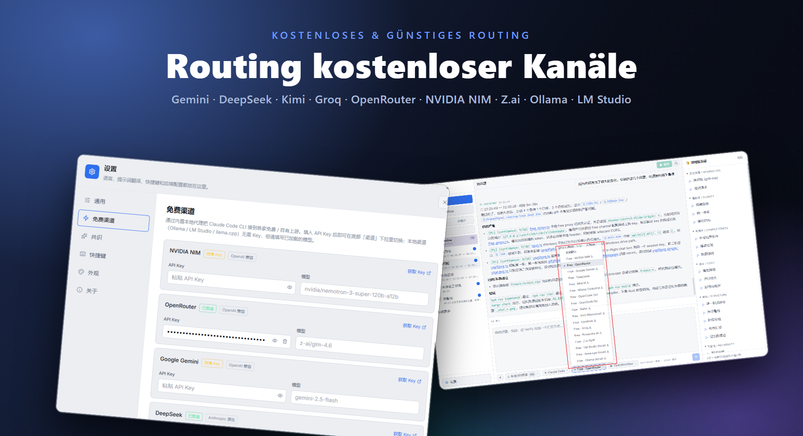
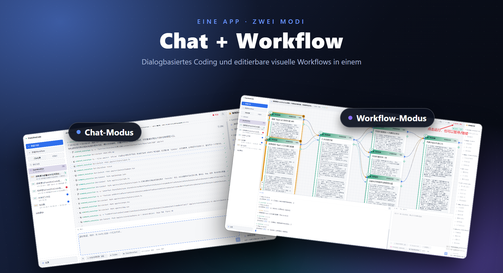

# FreeUltraCode

<div align="center">
  <a href="../../README.md">English</a> | <a href="README.zh-CN.md">中文</a> | <a href="README.fr.md">Français</a> | Deutsch | <a href="README.es.md">Español</a> | <a href="README.pt-BR.md">Português</a> | <a href="README.ru.md">Русский</a> | <a href="README.ja.md">日本語</a> | <a href="README.ko.md">한국어</a> | <a href="README.hi.md">हिन्दी</a> | <a href="README.ar.md">العربية</a>
</div>

FreeUltraCode ist eine Desktop-App, die kostenlosen KI-Chat und visuelle Multi-Agent-Workflow-Bearbeitung vereint. Chatte direkt über 17+ kostenlose Kanäle (Gemini, DeepSeek, Groq, Ollama…) oder baue Multi-Agent-Workflow-Graphen auf der Canvas, die zu ausführbaren Skripten für Claude Code, Codex, Gemini und weitere Runtimes kompiliert werden.

<p align="center">
  <strong>Routing kostenloser Kanäle</strong><br>
  
</p>

<p align="center">
  <strong>Zwei Modi — Chat &amp; Workflow</strong><br>
  
</p>

## Hauptfunktionen

### 🧊 Kostenloser KI-Chat
- **17+ kostenlose Kanäle** integriert — NVIDIA NIM, OpenRouter, Google Gemini, DeepSeek, Mistral, Groq, Cerebras, Fireworks, Kimi, Z.ai, OpenCode, Wafer, plus lokale Runtimes (Ollama, LM Studio, llama.cpp).
- Integrierter Rust-Proxy übersetzt zwischen Anthropic- und OpenAI-Protokollen, sodass alle Kanäle die gleiche Chat-Oberfläche nutzen.
- Kanal wählen, API-Key einfügen, direkt chatten — keine weitere Konfiguration nötig.
- Lokale Runtimes (Ollama, LM Studio, llama.cpp) funktionieren **ohne API-Key**.

### 🕸️ Visueller Workflow-Editor
- Ziel in der KI-Eingabe unten rechts beschreiben und eine bearbeitbare Workflow-Blueprint generieren.
- Visuelle Workflow-Erstellung statt manueller Bearbeitung großer Multi-Agent-Skripte.
- Blueprint kompiliert zu ausführbaren Workflow-Skripten im Claude Code-Stil; Skripte lassen sich zurück in die Blueprint laden.
- Runtime-Adapter wählen (Claude Code, Codex, Gemini) und Modell pro Node konfigurieren.
- Workflow starten/stoppen mit Node-level Ausführungsstatus in der Desktop-App.

### ⭐ Favoriten & Verlauf
- Sitzung mit Stern markieren und in der **Favoriten**-Tab für schnellen Zugriff anheften.
- **Verlauf**-Tab zeigt alle Sitzungen mit Badges: **CHAT** für einfache Konversationen, **WF** für Workflow-Sitzungen.
- Vollständiger Workspace- und Sitzungsverlauf — Kontextwechsel ohne Fortschrittsverlust.

### 🔒 Privatsphäre zuerst
- API-Schlüssel werden lokal auf Ihrem Gerät gespeichert, nie an einen Server gesendet.
- Alle Workflow-Daten, Sitzungen und Einstellungen bleiben auf Ihrem Gerät.

## Anwendungstutorial

- [FreeUltraCode Anwendungstutorial](claude-code-workflow-freeultracode.de.md) – Schritt-für-Schritt-Anleitung mit Screenshots von den allgemeinen Einstellungen und der Runtime-Auswahl in der KI-Eingabe bis zur Blueprint-Erstellung, Ausführung und Erscheinungsbild-Umschaltung.

## Schnellstart

```bash
cd app
npm install
npm run dev
```

Für die Desktop-App:

```bash
cd app
npm run desktop
```

Für ein Windows-Release-Paket:

```bash
cd app
npm run package
```

Vom Repository-Stammverzeichnis aus startet `run.bat` die App und baut sie bei Bedarf neu, und `build.bat` paketiert den Windows-Installer.

## Verwendung

### Chat-Modus

1. Klicken Sie **+ Neue Sitzung** in der Sidebar.
2. Wählen Sie einen kostenlosen Kanal (z.B. Gemini, DeepSeek, Ollama) oder nutzen Sie Ihren eigenen API-Key mit einer beliebigen Runtime.
3. Geben Sie Ihre Frage im unteren Eingabefeld ein. Antworten erscheinen im Chatbereich oben.
4. Sitzung mit Stern markieren, um sie in der **Favoriten**-Tab anzuheften.

### Workflow-Modus

1. Klicken Sie **+ Neuer Workflow** in der Sidebar.
2. Beschreiben Sie die Aufgabe in der KI-Eingabe unten rechts. FreeUltraCode generiert die Workflow-Blueprint automatisch.
3. Verfeinern Sie die Blueprint weiter, indem Sie Folgeanweisungen in dieselbe Eingabe eingeben, oder klicken Sie auf gängige Prompts im rechten Panel.
4. Wählen Sie einzelne Nodes aus, wenn Sie Prompts, Modelle, Schemas oder Ausführungsparameter manuell bearbeiten müssen.
5. Wählen Sie einen Runtime-Adapter wie Claude Code, Codex oder Gemini.
6. Klicken Sie oben auf die Schaltfläche „Ausführen", um den Workflow auszuführen und Node-level Statusaktualisierungen zu beobachten.

## Projektstruktur

```text
app/
  src/                 React + TypeScript frontend
    core/              IR, parser, emitter, round-trip logic
    canvas/            React Flow canvas and node components
    panels/            Sidebar (history + favorites), prompt panel, AI dock (chat + workflow), settings (free channels)
    runtime/           DAG execution, provider gateway, run state
    store/             Zustand application state
    lib/
      freeChannels.ts  17+ free channel catalog + helpers
  src-tauri/
    src/
      free_proxy.rs    Rust reverse-proxy + Anthropic↔OpenAI translation
      lib.rs           Tauri commands, filesystem/history bridge
  doc/                 Usage tutorial and screenshots
pencil/                Pencil design files
run.bat                Build-if-needed and launch the Windows app
build.bat              Build the Windows installer
```

## Weitere Dokumentation

- [Englische README](../../README.md)
- [Englisches Anwendungstutorial](claude-code-workflow-freeultracode.en.md)

## Verifizierung

```bash
cd app
npm run typecheck
npm run lint
npm run package
```

## Lizenz

Es wurde noch keine Lizenz angegeben.
