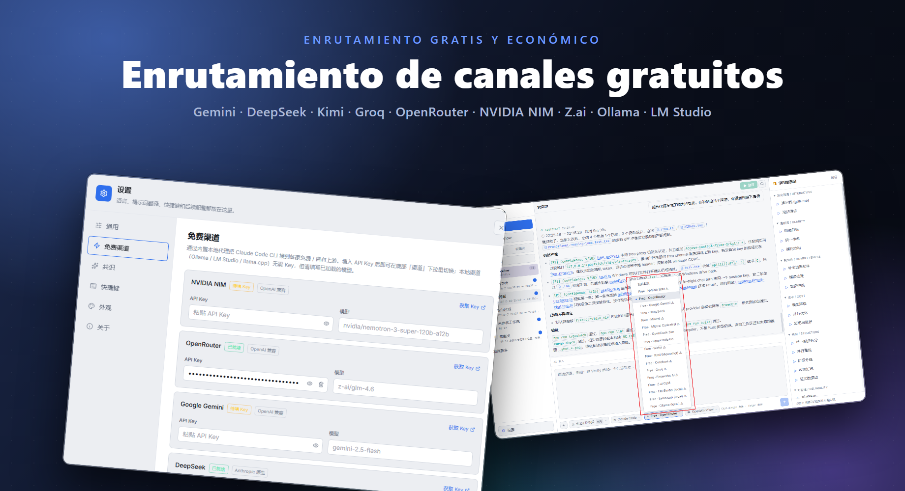
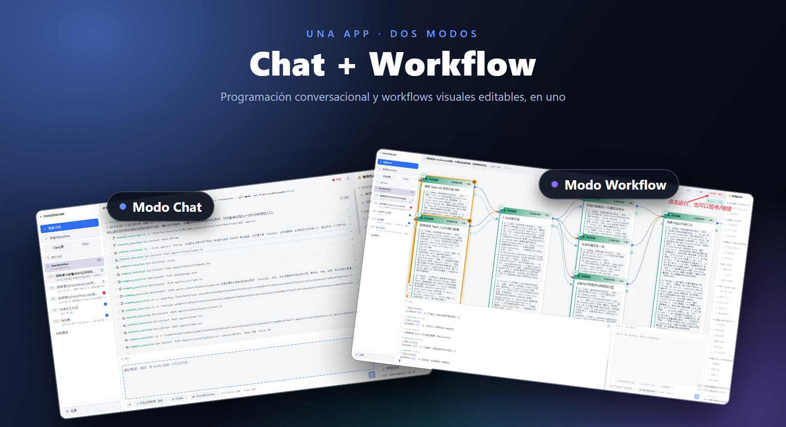

# FreeUltraCode

<div align="center">
  <a href="../../README.md">English</a> | <a href="README.zh-CN.md">中文</a> | <a href="README.fr.md">Français</a> | <a href="README.de.md">Deutsch</a> | Español | <a href="README.pt-BR.md">Português</a> | <a href="README.ru.md">Русский</a> | <a href="README.ja.md">日本語</a> | <a href="README.ko.md">한국어</a> | <a href="README.hi.md">हिन्दी</a> | <a href="README.ar.md">العربية</a>
</div>

FreeUltraCode es una aplicación de escritorio que combina chat gratuito con modelos de IA y edición visual de workflows multi-agente. Chatea directamente con 17+ canales gratuitos (Gemini, DeepSeek, Groq, Ollama…) o construye gráficos de workflows multi-agente en el lienzo que se compilan en scripts ejecutables para Claude Code, Codex, Gemini y otros runtimes.

<p align="center">
  <strong>Enrutamiento de canales gratuitos</strong><br>
  
</p>

<p align="center">
  <strong>Dos modos: Chat y Workflow</strong><br>
  
</p>

## Funciones principales

### 🧊 Chat gratuito con modelos de IA
- **17+ canales gratuitos** integrados — NVIDIA NIM, OpenRouter, Google Gemini, DeepSeek, Mistral, Groq, Cerebras, Fireworks, Kimi, Z.ai, OpenCode, Wafer, además de runtimes locales (Ollama, LM Studio, llama.cpp).
- Proxy Rust integrado traduce entre protocolos Anthropic y OpenAI, así que todos los canales usan la misma interfaz de chat.
- Elige un canal, pega tu API key y empieza a chatear — sin configuración adicional.
- Runtimes locales (Ollama, LM Studio, llama.cpp) funcionan **sin API key**.

### 🕸️ Editor visual de Workflows
- Describe el objetivo en el campo de entrada de IA de la esquina inferior derecha y genera un blueprint de Workflow editable.
- Creación visual de workflows en lugar de editar a mano grandes scripts multiagente.
- Compila el blueprint en scripts de Workflow ejecutables al estilo de Claude Code; los scripts se pueden cargar de vuelta al blueprint.
- Elige adaptadores de runtime (Claude Code, Codex, Gemini) y configura el modelo de cada nodo.
- Inicia/detén workflows desde la app de escritorio con estado de ejecución por nodo.

### ⭐ Favoritos e Historial
- Marca una sesión con una estrella para fijarla en la pestaña **Favoritos** para acceso rápido.
- La pestaña **Historial** muestra todas las sesiones con badges: **CHAT** para conversaciones simples, **WF** para sesiones de workflow.
- Historial completo de espacios de trabajo y sesiones — cambia de contexto sin perder progreso.

### 🔒 Privacidad primero
- Las claves API se almacenan localmente en tu máquina, nunca se envían a ningún servidor.
- Todos los datos de workflows, sesiones y configuraciones permanecen en tu máquina.

## Tutorial de uso

- [Tutorial de uso de FreeUltraCode](claude-code-workflow-freeultracode.es.md) - recorrido paso a paso con capturas de pantalla, desde la configuración general y la selección de runtime en la entrada de IA hasta la generación del blueprint, la ejecución y el cambio de apariencia.

## Inicio rápido

```bash
cd app
npm install
npm run dev
```

Para la aplicación de escritorio:

```bash
cd app
npm run desktop
```

Para un paquete de release de Windows:

```bash
cd app
npm run package
```

Desde la raíz del repositorio, `run.bat` inicia la aplicación y la reconstruye cuando es necesario, y `build.bat` empaqueta el instalador de Windows.

## Uso

### Modo Chat

1. Haz clic en **+ Nueva sesión** en la barra lateral.
2. Elige un canal gratuito (ej. Gemini, DeepSeek, Ollama) o usa tu propia API key con cualquier runtime.
3. Escribe tu pregunta en el campo de entrada inferior. Las respuestas aparecen en el área de chat arriba.
4. Marca una sesión con estrella para fijarla en la pestaña **Favoritos**.

### Modo Workflow

1. Haz clic en **+ Nuevo workflow** en la barra lateral.
2. Describe la tarea en el campo de entrada de IA de la esquina inferior derecha. FreeUltraCode genera el blueprint de Workflow automáticamente.
3. Sigue refinando el blueprint escribiendo instrucciones de seguimiento, o haz clic en los prompts habituales del panel derecho.
4. Selecciona nodos individuales cuando necesites editar manualmente prompts, modelos, schemas o parámetros de ejecución.
5. Elige un adaptador de runtime como Claude Code, Codex o Gemini.
6. Haz clic en el botón Run de la parte superior para ejecutar el workflow y observar las actualizaciones de estado por nodo.

## Estructura del proyecto

```text
app/
  src/                 React + TypeScript frontend
    core/              IR, parser, emitter, round-trip logic
    canvas/            React Flow canvas and node components
    panels/            Sidebar (history + favorites), prompt panel, AI dock (chat + workflow), settings (free channels)
    runtime/           DAG execution, provider gateway, run state
    store/             Zustand application state
    lib/
      freeChannels.ts  17+ free channel catalog + helpers
  src-tauri/
    src/
      free_proxy.rs    Rust reverse-proxy + Anthropic↔OpenAI translation
      lib.rs           Tauri commands, filesystem/history bridge
  doc/                 Usage tutorial and screenshots
pencil/                Pencil design files
run.bat                Build-if-needed and launch the Windows app
build.bat              Build the Windows installer
```

## Más documentación

- [README en inglés](../../README.md)
- [Tutorial de uso en inglés](claude-code-workflow-freeultracode.en.md)

## Verificación

```bash
cd app
npm run typecheck
npm run lint
npm run package
```

## Licencia

Todavía no se ha especificado ninguna licencia.
