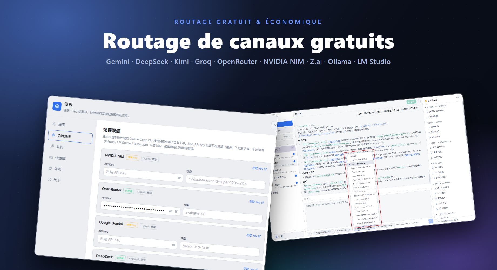
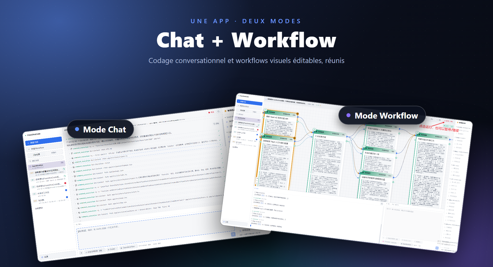

# FreeUltraCode

<div align="center">
  <a href="../../README.md">English</a> | <a href="README.zh-CN.md">中文</a> | Français | <a href="README.de.md">Deutsch</a> | <a href="README.es.md">Español</a> | <a href="README.pt-BR.md">Português</a> | <a href="README.ru.md">Русский</a> | <a href="README.ja.md">日本語</a> | <a href="README.ko.md">한국어</a> | <a href="README.hi.md">हिन्दी</a> | <a href="README.ar.md">العربية</a>
</div>

FreeUltraCode est une application desktop qui combine chat gratuit avec des modèles d'IA et l'édition visuelle de workflows multi-agents. Discutez directement via 17+ canaux gratuits (Gemini, DeepSeek, Groq, Ollama…) ou construisez des graphes de workflows multi-agents sur le canevas, compilés en scripts exécutables pour Claude Code, Codex, Gemini et autres runtimes.

<p align="center">
  <strong>Routage des canaux gratuits</strong><br>
  
</p>

<p align="center">
  <strong>Deux modes — Chat et Workflow</strong><br>
  
</p>

## Fonctions principales

### 🧊 Chat gratuit avec modèles d'IA
- **17+ canaux gratuits** intégrés — NVIDIA NIM, OpenRouter, Google Gemini, DeepSeek, Mistral, Groq, Cerebras, Fireworks, Kimi, Z.ai, OpenCode, Wafer, ainsi que les runtimes locaux (Ollama, LM Studio, llama.cpp).
- Proxy Rust intégré traduit entre les protocoles Anthropic et OpenAI, donc tous les canaux utilisent la même interface de chat.
- Choisissez un canal, collez votre clé API et commencez à discuter — aucune configuration supplémentaire.
- Les runtimes locaux (Ollama, LM Studio, llama.cpp) fonctionnent **sans clé API**.

### 🕸️ Éditeur visuel de Workflows
- Décrivez l'objectif dans le champ de saisie IA en bas à droite et générez un blueprint Workflow éditable.
- Création visuelle de workflows plutôt que l'édition manuelle de grands scripts multi-agents.
- Le blueprint se compile en scripts Workflow exécutables de style Claude Code ; les scripts peuvent être rechargés dans le blueprint.
- Choisissez des adaptateurs de runtime (Claude Code, Codex, Gemini) et configurez le modèle de chaque nœud.
- Lancez/arrêtez les workflows depuis l'application desktop avec un état d'exécution par nœud.

### ⭐ Favoris et Historique
- Marquez une session avec une étoile pour l'épingler dans l'onglet **Favoris** pour un accès rapide.
- L'onglet **Historique** affiche toutes les sessions avec badges : **CHAT** pour les conversations simples, **WF** pour les sessions de workflow.
- Historique complet des espaces de travail et des sessions — changement de contexte sans perte de progression.

### 🔒 Confidentialité d'abord
- Les clés API sont stockées localement sur votre machine, jamais envoyées à un serveur.
- Toutes les données de workflows, sessions et paramètres restent sur votre machine.

## Tutoriel d'utilisation

- [Tutoriel d'utilisation d'FreeUltraCode](claude-code-workflow-freeultracode.fr.md) - guide pas à pas avec captures d'écran, des réglages généraux et du choix du runtime dans la zone IA à la génération du blueprint, l'exécution et le changement d'apparence.

## Démarrage rapide

```bash
cd app
npm install
npm run dev
```

Pour l'application de bureau :

```bash
cd app
npm run desktop
```

Pour un package de release Windows :

```bash
cd app
npm run package
```

Depuis la racine du dépôt, `run.bat` lance l'application et la reconstruit si nécessaire, et `build.bat` empaquette l'installateur Windows.

## Utilisation

### Mode Chat

1. Cliquez sur **+ Nouvelle session** dans la barre latérale.
2. Choisissez un canal gratuit (ex. Gemini, DeepSeek, Ollama) ou utilisez votre propre clé API avec un runtime quelconque.
3. Tapez votre question dans le champ de saisie en bas. Les réponses apparaissent dans la zone de chat au-dessus.
4. Marquez une session avec une étoile pour l'épingler dans l'onglet **Favoris**.

### Mode Workflow

1. Cliquez sur **+ Nouveau workflow** dans la barre latérale.
2. Décrivez la tâche dans le champ de saisie IA en bas à droite. FreeUltraCode génère automatiquement le blueprint Workflow.
3. Continuez à affiner le blueprint en saisissant des instructions de suivi, ou cliquez sur les prompts courants du panneau de droite.
4. Sélectionnez des nœuds individuels lorsque vous devez modifier manuellement les prompts, les modèles, les schemas ou les paramètres d'exécution.
5. Choisissez un adaptateur de runtime tel que Claude Code, Codex ou Gemini.
6. Cliquez sur le bouton Run en haut pour exécuter le workflow et observer les mises à jour de statut de chaque nœud.

## Organisation du projet

```text
app/
  src/                 React + TypeScript frontend
    core/              IR, parser, emitter, round-trip logic
    canvas/            React Flow canvas and node components
    panels/            Sidebar (history + favorites), prompt panel, AI dock (chat + workflow), settings (free channels)
    runtime/           DAG execution, provider gateway, run state
    store/             Zustand application state
    lib/
      freeChannels.ts  17+ free channel catalog + helpers
  src-tauri/
    src/
      free_proxy.rs    Rust reverse-proxy + Anthropic↔OpenAI translation
      lib.rs           Tauri commands, filesystem/history bridge
  doc/                 Usage tutorial and screenshots
pencil/                Pencil design files
run.bat                Build-if-needed and launch the Windows app
build.bat              Build the Windows installer
```

## Documentation supplémentaire

- [README en anglais](../../README.md)
- [Tutoriel d'utilisation en anglais](claude-code-workflow-freeultracode.en.md)

## Vérification

```bash
cd app
npm run typecheck
npm run lint
npm run package
```

## Licence

Aucune licence n'a encore été spécifiée.
