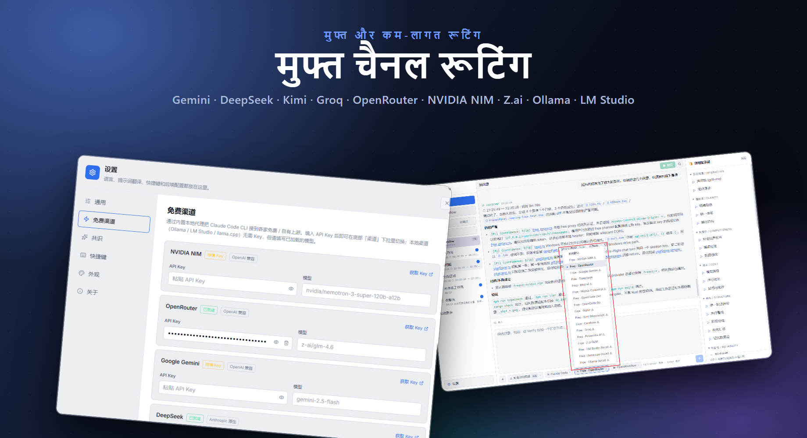
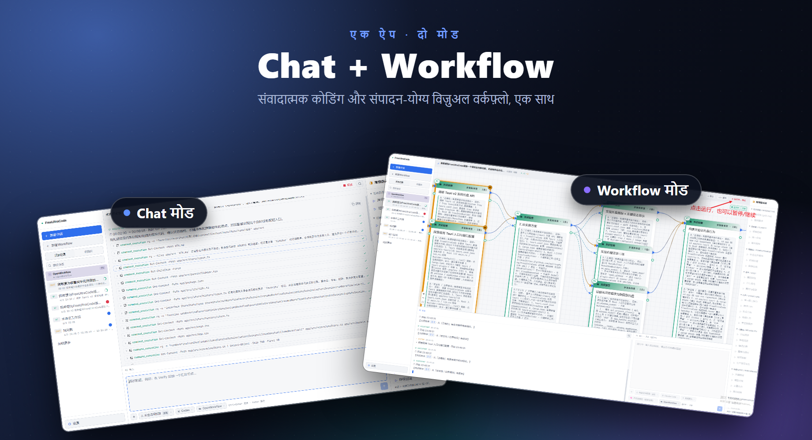

# FreeUltraCode

<div align="center">
  <a href="../../README.md">English</a> | <a href="README.zh-CN.md">中文</a> | <a href="README.fr.md">Français</a> | <a href="README.de.md">Deutsch</a> | <a href="README.es.md">Español</a> | <a href="README.pt-BR.md">Português</a> | <a href="README.ru.md">Русский</a> | <a href="README.ja.md">日本語</a> | <a href="README.ko.md">한국어</a> | हिन्दी | <a href="README.ar.md">العربية</a>
</div>

FreeUltraCode एक डेस्कटॉप एप्लिकेशन है जो मुफ्त AI मॉडल चैट और विज़ुअल मल्टी-एजेंट वर्कफ़्लो संपादन को जोड़ती है। 17+ मुफ्त चैनलों (Gemini, DeepSeek, Groq, Ollama…) के माध्यम से सीधे चैट करें, या कैनवास पर मल्टी-एजेंट वर्कफ़्लो ग्राफ़ बनाएं जो Claude Code, Codex, Gemini और अन्य रनटाइम के लिए चलाने-योग्य स्क्रिप्ट में संकलित होते हैं।

<p align="center">
  <strong>मुफ्त चैनल रूटिंग</strong><br>
  
</p>

<p align="center">
  <strong>दो मोड — Chat और Workflow</strong><br>
  
</p>

## मुख्य विशेषताएं

### 🧊 मुफ्त AI मॉडल चैट
- **17+ मुफ्त चैनल** अंतर्निहित — NVIDIA NIM, OpenRouter, Google Gemini, DeepSeek, Mistral, Groq, Cerebras, Fireworks, Kimi, Z.ai, OpenCode, Wafer, साथ ही लोकल रनटाइम (Ollama, LM Studio, llama.cpp)।
- अंतर्निहित Rust प्रॉक्सी Anthropic और OpenAI प्रोटोकॉल के बीच अनुवाद करता है, ताकि सभी चैनल एक ही चैट इंटरफ़ेस का उपयोग कर सकें।
- चैनल चुनें, API कुंजी पेस्ट करें, चैट शुरू करें — कोई अतिरिक्त सेटअप नहीं।
- लोकल रनटाइम (Ollama, LM Studio, llama.cpp) **बिना API कुंजी** काम करते हैं।

### 🕸️ विज़ुअल वर्कफ़्लो संपादक
- नीचे-दाईं ओर AI इनपुट में लक्ष्य का वर्णन करें और एक संपादन-योग्य Workflow ब्लूप्रिंट तैयार करें।
- बड़ी मल्टी-एजेंट स्क्रिप्ट को हाथ से संपादित करने के बजाय विज़ुअल वर्कफ़्लो रचना।
- ब्लूप्रिंट Claude Code-शैली के चलाने-योग्य Workflow स्क्रिप्ट में संकलित होता है; स्क्रिप्ट वापस ब्लूप्रिंट में लोड हो सकती हैं।
- रनटाइम अडैप्टर चुनें (Claude Code, Codex, Gemini) और प्रत्येक नोड का मॉडल कॉन्फ़िगर करें।
- डेस्कटॉप एप्लिकेशन से वर्कफ़्लो शुरू/रोकें, प्रति-नोड निष्पादन स्थिति ट्रैक करें।

### ⭐ पसंदीदा और इतिहास
- किसी सत्र को स्टार करें और उसे **पसंदीदा** टैब में पिन करें ताकि तेज़ी से पहुंच सकें।
- **इतिहास** टैब सभी सत्रों को बैज के साथ दिखाता है: **CHAT** साधारण वार्तालाप के लिए, **WF** वर्कफ़्लो सत्रों के लिए।
- पूर्ण वर्कस्पेस और सत्र इतिहास — संदर्भ बदलें, प्रगति खोएं नहीं।

### 🔒 गोपनीयता पहले
- API कुंजी आपकी मशीन पर लोकल रूप से संग्रहीत होती है, कभी किसी सर्वर पर नहीं भेजी जाती।
- सभी वर्कफ़्लो डेटा, सत्र और सेटिंग्स आपकी मशीन पर रहते हैं।

## उपयोग ट्यूटोरियल

- [FreeUltraCode उपयोग ट्यूटोरियल](claude-code-workflow-freeultracode.hi.md) - सामान्य सेटिंग्स और AI इनपुट में runtime selection से लेकर blueprint generation, running और appearance switching तक स्क्रीनशॉट के साथ चरण-दर-चरण मार्गदर्शिका।

## त्वरित शुरुआत

```bash
cd app
npm install
npm run dev
```

डेस्कटॉप ऐप के लिए:

```bash
cd app
npm run desktop
```

Windows रिलीज़ पैकेज के लिए:

```bash
cd app
npm run package
```

रिपॉज़िटरी रूट से, `run.bat` ऐप को लॉन्च करता है और ज़रूरत पड़ने पर पुनः बिल्ड करता है, और `build.bat` Windows इंस्टॉलर को पैकेज करता है।

## उपयोग

### चैट मोड

1. साइडबार में **+ नया सत्र** क्लिक करें।
2. एक मुफ्त चैनल (जैसे Gemini, DeepSeek, Ollama) चुनें या किसी रनटाइम के साथ अपनी API कुंजी का उपयोग करें।
3. नीचे इनपुट बॉक्स में प्रश्न टाइप करें। उत्तर ऊपर चैट क्षेत्र में दिखेंगे।
4. सत्र को स्टार करें और **पसंदीदा** टैब में पिन करें।

### वर्कफ़्लो मोड

1. साइडबार में **+ नया वर्कफ़्लो** क्लिक करें।
2. नीचे-दाईं ओर AI इनपुट में कार्य का वर्णन करें। FreeUltraCode स्वचालित रूप से Workflow ब्लूप्रिंट तैयार करता है।
3. उसी इनपुट में अनुवर्ती निर्देश टाइप करके ब्लूप्रिंट को परिष्कृत करते रहें, या दाएं पैनल पर सामान्य प्रॉम्प्ट क्लिक करें।
4. प्रॉम्प्ट, मॉडल, schema, या निष्पादन पैरामीटर मैन्युअल रूप से संपादित करने की आवश्यकता हो तो अलग-अलग नोड चुनें।
5. Claude Code, Codex, या Gemini जैसे रनटाइम अडैप्टर का चयन करें।
6. वर्कफ़्लो को निष्पादित करने के लिए शीर्ष Run बटन क्लिक करें, प्रति-नोड स्थिति अपडेट देखें।

## प्रोजेक्ट लेआउट

```text
app/
  src/                 React + TypeScript frontend
    core/              IR, parser, emitter, round-trip logic
    canvas/            React Flow canvas and node components
    panels/            Sidebar (history + favorites), prompt panel, AI dock (chat + workflow), settings (free channels)
    runtime/           DAG execution, provider gateway, run state
    store/             Zustand application state
    lib/
      freeChannels.ts  17+ free channel catalog + helpers
  src-tauri/
    src/
      free_proxy.rs    Rust reverse-proxy + Anthropic↔OpenAI translation
      lib.rs           Tauri commands, filesystem/history bridge
  doc/                 Usage tutorial and screenshots
pencil/                Pencil design files
run.bat                Build-if-needed and launch the Windows app
build.bat              Build the Windows installer
```

## और दस्तावेज़

- [अंग्रेज़ी README](../../README.md)
- [अंग्रेज़ी उपयोग ट्यूटोरियल](claude-code-workflow-freeultracode.en.md)

## सत्यापन

```bash
cd app
npm run typecheck
npm run lint
npm run package
```

## लाइसेंस

अभी तक कोई लाइसेंस निर्दिष्ट नहीं किया गया है।
