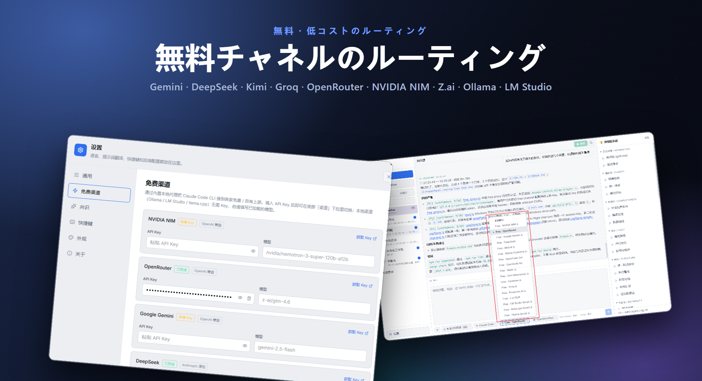
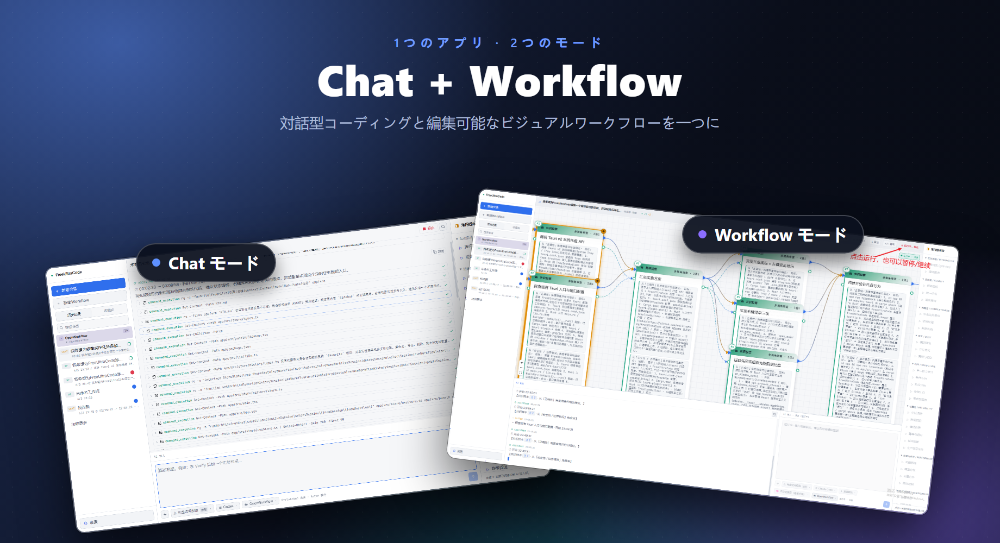

# FreeUltraCode

<div align="center">
  <a href="../../README.md">English</a> | <a href="README.zh-CN.md">中文</a> | <a href="README.fr.md">Français</a> | <a href="README.de.md">Deutsch</a> | <a href="README.es.md">Español</a> | <a href="README.pt-BR.md">Português</a> | <a href="README.ru.md">Русский</a> | 日本語 | <a href="README.ko.md">한국어</a> | <a href="README.hi.md">हिन्दी</a> | <a href="README.ar.md">العربية</a>
</div>

FreeUltraCode は、無料 AI モデルチャットとビジュアルなマルチエージェントワークフロー編集を組み合わせたデスクトップアプリです。17+ の無料チャネル（Gemini、DeepSeek、Groq、Ollama…）で直接チャットするか、キャンバス上にマルチエージェントワークフローグラフを構築し、Claude Code、Codex、Gemini などのランタイム向け実行可能スクリプトにコンパイルできます。

<p align="center">
  <strong>無料チャネルのルーティング</strong><br>
  
</p>

<p align="center">
  <strong>Chat と Workflow の 2 つのモード</strong><br>
  
</p>

## 主な機能

### 🧊 無料 AI モデルチャット
- **17+ の無料チャネル** 組み込み — NVIDIA NIM、OpenRouter、Google Gemini、DeepSeek、Mistral、Groq、Cerebras、Fireworks、Kimi、Z.ai、OpenCode、Wafer、ローカルランタイム（Ollama、LM Studio、llama.cpp）。
- 組み込み Rust プロキシが Anthropic と OpenAI プロトコル間を翻訳し、すべてのチャネルが同じチャットインターフェースで動作。
- チャネルを選び、APIキーを貼り付けて、すぐチャット開始 — 追加設定不要。
- ローカルランタイム（Ollama、LM Studio、llama.cpp）は **APIキー不要** で動作。

### 🕸️ ビジュアルワークフロー編集
- 右下の AI 入力欄に目標を記述し、編集可能な Workflow ブループリントを生成。
- 大規模なマルチエージェントスクリプトを手作業で編集する代わりに、ビジュアルなワークフロー作成。
- ブループリントを Claude Code スタイルの実行可能 Workflow スクリプトにコンパイル；スクリプトからブループリントへの逆変換も可能。
- ランタイムアダプタ（Claude Code、Codex、Gemini）を選択し、各ノードのモデルを設定。
- デスクトップアプリからワークフローを開始/停止、ノードごとの実行状態を追跡。

### ⭐ お気に入りと履歴
- セッションにスターを付け、**お気に入り** タブにピン留めして迅速にアクセス。
- **履歴** タブはすべてのセッションをバッジ付きで表示：**CHAT** は単純な会話、**WF** はワークフローセッション。
- 完全なワークスペースとセッション履歴 — コンテキスト切替で進捗を失わない。

### 🔒 プライバシー優先
- APIキーはローカルマシン上にのみ保存され、サーバーに送信されません。
- ワークフローデータ、セッション、設定はすべてマシン上に留まります。

## 使い方チュートリアル

- [FreeUltraCode 使い方チュートリアル](claude-code-workflow-freeultracode.ja.md) - 一般設定と AI 入力欄でのランタイム選択から、ブループリント生成、実行、外観切り替えまでをスクリーンショット付きで段階的に解説します。

## クイックスタート

```bash
cd app
npm install
npm run dev
```

デスクトップアプリの場合:

```bash
cd app
npm run desktop
```

Windows 用リリースパッケージの場合:

```bash
cd app
npm run package
```

リポジトリのルートから、`run.bat` はアプリを起動し必要に応じて再ビルドし、`build.bat` は Windows インストーラをパッケージ化します。

## 使い方

### チャットモード

1. サイドバーの **+ 新しいセッション** をクリック。
2. 無料チャネル（例：Gemini、DeepSeek、Ollama）を選ぶか、任意のランタイムで自分の APIキーを使用。
3. 下部の入力欄に質問を入力。回答は上部のチャット領域に表示されます。
4. セッションにスターを付け、**お気に入り** タブにピン留め。

### ワークフローモード

1. サイドバーの **+ 新しいワークフロー** をクリック。
2. 右下の AI 入力欄でタスクを記述。FreeUltraCode が Workflow ブループリントを自動生成。
3. 同じ入力欄に追加の指示を入力してブループリントを磨き続けるか、右パネルの一般的なプロンプトをクリック。
4. プロンプト、モデル、schema、実行パラメータを手動で編集する必要がある場合は、個々のノードを選択。
5. Claude Code、Codex、Gemini などのランタイムアダプタを選択。
6. 上部の Run ボタンをクリックしてワークフローを実行し、ノードごとのステータス更新を確認。

## プロジェクト構成

```text
app/
  src/                 React + TypeScript frontend
    core/              IR, parser, emitter, round-trip logic
    canvas/            React Flow canvas and node components
    panels/            Sidebar (history + favorites), prompt panel, AI dock (chat + workflow), settings (free channels)
    runtime/           DAG execution, provider gateway, run state
    store/             Zustand application state
    lib/
      freeChannels.ts  17+ free channel catalog + helpers
  src-tauri/
    src/
      free_proxy.rs    Rust reverse-proxy + Anthropic↔OpenAI translation
      lib.rs           Tauri commands, filesystem/history bridge
  doc/                 Usage tutorial and screenshots
pencil/                Pencil design files
run.bat                Build-if-needed and launch the Windows app
build.bat              Build the Windows installer
```

## その他のドキュメント

- [英語版 README](../../README.md)
- [英語版 使い方チュートリアル](claude-code-workflow-freeultracode.en.md)

## 検証

```bash
cd app
npm run typecheck
npm run lint
npm run package
```

## ライセンス

ライセンスはまだ指定されていません。
