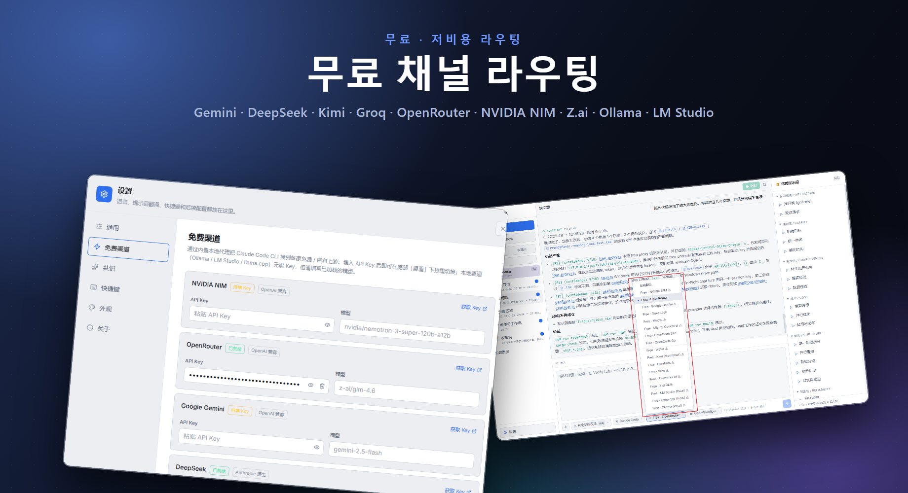
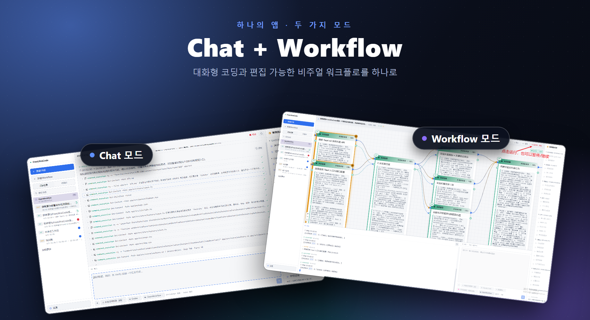

# FreeUltraCode

<div align="center">
  <a href="../../README.md">English</a> | <a href="README.zh-CN.md">中文</a> | <a href="README.fr.md">Français</a> | <a href="README.de.md">Deutsch</a> | <a href="README.es.md">Español</a> | <a href="README.pt-BR.md">Português</a> | <a href="README.ru.md">Русский</a> | <a href="README.ja.md">日本語</a> | 한국어 | <a href="README.hi.md">हिन्दी</a> | <a href="README.ar.md">العربية</a>
</div>

FreeUltraCode는 무료 AI 모델 채팅과 시각적 멀티 에이전트 워크플로우 편집을 결합한 데스크톱 앱입니다. 17+ 무료 채널(Gemini, DeepSeek, Groq, Ollama…)으로 직접 채팅하거나, 캔버스에서 멀티 에이전트 워크플로우 그래프를 구축하여 Claude Code, Codex, Gemini 등 런타임용 실행 스크립트로 컴파일할 수 있습니다.

<p align="center">
  <strong>무료 채널 라우팅</strong><br>
  
</p>

<p align="center">
  <strong>Chat과 Workflow 두 가지 모드</strong><br>
  
</p>

## 주요 기능

### 🧊 무료 AI 모델 채팅
- **17+ 무료 채널** 내장 — NVIDIA NIM, OpenRouter, Google Gemini, DeepSeek, Mistral, Groq, Cerebras, Fireworks, Kimi, Z.ai, OpenCode, Wafer, 로컬 런타임(Ollama, LM Studio, llama.cpp).
- 내장 Rust 프로xy가 Anthropic과 OpenAI 프로토콜을 번역하여 모든 채널이 동일한 채팅 인터페이스로 작동.
- 채널 선택, API 키 붙여넣기, 즉시 채팅 시작 — 추가 설정 없음.
- 로컬 런타임(Ollama, LM Studio, llama.cpp)은 **API 키 없이** 작동.

### 🕸️ 시각적 워크플로우 편집기
- 오른쪽 하단 AI 입력창에 목표를 설명하면 편집 가능한 Workflow 블루프린트가 생성됩니다.
- 대규모 멀티 에이전트 스크립트를 수동으로 편집하는 대신 시각적 워크플로우 작성.
- 블루프린트를 Claude Code 스타일의 실행 가능 Workflow 스크립트로 컴파일; 스크립트에서 블루프린트로 역변환 가능.
- 런타임 어댑터(Claude Code, Codex, Gemini) 선택 및 각 노드 모델 설정.
- 데스크톱 앱에서 워크플로우 시작/중지, 노드별 실행 상태 추적.

### ⭐ 즐겨찾기 및 기록
- 세션에 스탰를 표시하여 **즐겨찾기** 탭에 고정하고 빠르게 접근.
- **기록** 탭은 모든 세션을 배지와 함께 표시: **CHAT**은 단순 대화, **WF**은 워크플로우 세션.
- 전체 워크스페이스 및 세션 기록 — 컨텍스트 전환 시 진행 상태 유지.

### 🔒 개인정보 보호 우선
- API 키는 로컬 기기에만 저장되며, 서버로 전송되지 않습니다.
- 모든 워크플로우 데이터, 세션 및 설정은 기기에 남습니다.

## 사용 튜토리얼

- [FreeUltraCode 사용 튜토리얼](claude-code-workflow-freeultracode.ko.md) - 일반 설정과 AI 입력창의 런타임 선택부터 블루프린트 생성, 실행, 외관 전환까지 스크린샷과 함께 단계별로 안내합니다.

## 빠른 시작

```bash
cd app
npm install
npm run dev
```

데스크톱 앱의 경우:

```bash
cd app
npm run desktop
```

Windows 릴리스 패키지의 경우:

```bash
cd app
npm run package
```

저장소 루트에서 `run.bat`은 필요 시 앱을 빌드하고 실행하며, `build.bat`은 Windows 설치 프로그램을 패키징합니다.

## 사용법

### 채팅 모드

1. 사이드바에서 **+ 새 세션** 클릭.
2. 무료 채널(예: Gemini, DeepSeek, Ollama)을 선택하거나 원하는 런타임에 자신의 API 키를 사용.
3. 하단 입력창에 질문 입력. 답변은 상단 채팅 영역에 표시됩니다.
4. 세션에 스탰를 표시하여 **즐겨찾기** 탭에 고정.

### 워크플로우 모드

1. 사이드바에서 **+ 새 워크플로우** 클릭.
2. 오른쪽 하단 AI 입력창에 작업을 설명. FreeUltraCode가 Workflow 블루프린트를 자동 생성.
3. 동일한 입력창에 후속 지침을 입력하여 블루프린트를 다듬거나, 오른쪽 패널의 일반 프롬프트를 클릭.
4. 프롬프트, 모델, 스키마 또는 실행 매개변수를 수동으로 편집해야 할 때는 개별 노드를 선택.
5. Claude Code, Codex, Gemini 등의 런타임 어댑터를 선택.
6. 상단의 실행 버튼을 클릭하여 워크플로우를 실행하고 노드별 상태 업데이트를 확인.

## 프로젝트 구조

```text
app/
  src/                 React + TypeScript 프론트엔드
    core/              IR, 파서, 에미터, 왕복 검증 로직
    canvas/            React Flow 캔버스 및 노드 컴포넌트
    panels/            사이드바(기록 + 즐겨찾기), 프롬프트 패널, AI 도크(채팅 + 워크플로우), 설정(무료 채널)
    runtime/           DAG 실행, 프로바이더 게이트웨이, 실행 상태
    store/             Zustand 애플리케션 상태
    lib/
      freeChannels.ts  17+ 무료 채널 카탈로그 + 헬퍼
  src-tauri/
    src/
      free_proxy.rs    Rust 리버스 프록시 + Anthropic↔OpenAI 변환
      lib.rs           Tauri 명령, 파일시스템/기록 브리지
  doc/                 사용 튜토리얼 및 스크린샷
pencil/                Pencil 디자인 파일
run.bat                필요 시 빌드하고 Windows 앱 실행
build.bat              Windows 설치 프로그램 패키징
```

## 추가 문서

- [영어 README](../../README.md)
- [영어 사용 튜토리얼](claude-code-workflow-freeultracode.en.md)

## 검증

```bash
cd app
npm run typecheck
npm run lint
npm run package
```

## 라이선스

아직 라이선스가 지정되지 않았습니다.
