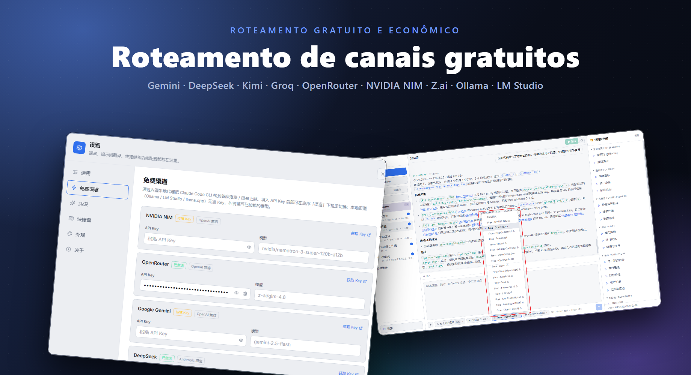
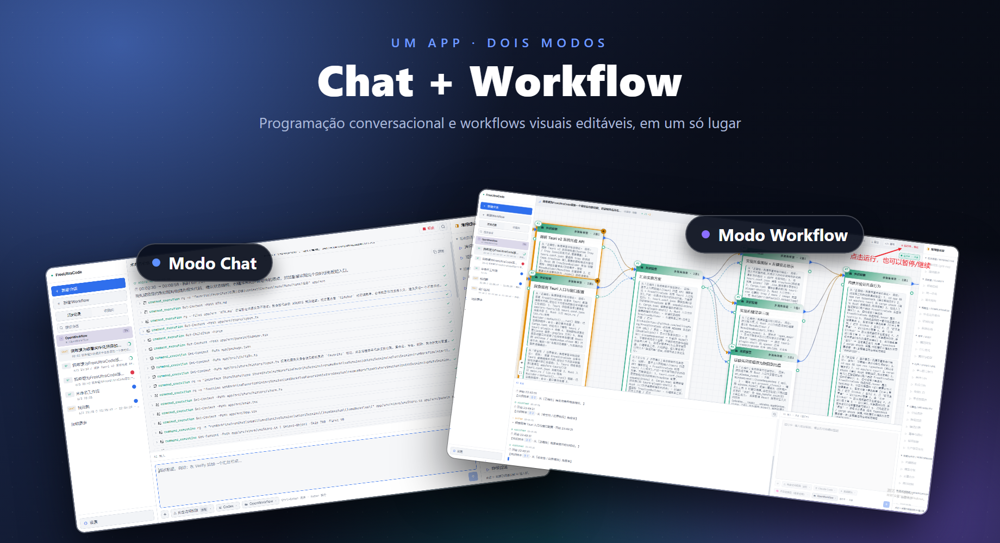

# FreeUltraCode

<div align="center">
  <a href="../../README.md">English</a> | <a href="README.zh-CN.md">中文</a> | <a href="README.fr.md">Français</a> | <a href="README.de.md">Deutsch</a> | <a href="README.es.md">Español</a> | Português | <a href="README.ru.md">Русский</a> | <a href="README.ja.md">日本語</a> | <a href="README.ko.md">한국어</a> | <a href="README.hi.md">हिन्दी</a> | <a href="README.ar.md">العربية</a>
</div>

O FreeUltraCode é um aplicativo desktop que combina chat gratuito com modelos de IA e edição visual de workflows multiagente. Converse diretamente via 17+ canais gratuitos (Gemini, DeepSeek, Groq, Ollama…) ou construa grafos de workflows multiagente na canvas, compilados em scripts executáveis para Claude Code, Codex, Gemini e outros runtimes.

<p align="center">
  <strong>Roteamento de canais gratuitos</strong><br>
  
</p>

<p align="center">
  <strong>Dois modos — Chat e Workflow</strong><br>
  
</p>

## Funcionalidades principais

### 🧊 Chat gratuito com modelos de IA
- **17+ canais gratuitos** integrados — NVIDIA NIM, OpenRouter, Google Gemini, DeepSeek, Mistral, Groq, Cerebras, Fireworks, Kimi, Z.ai, OpenCode, Wafer, além de runtimes locais (Ollama, LM Studio, llama.cpp).
- Proxy Rust integrado traduz entre protocolos Anthropic e OpenAI, então todos os canais usam a mesma interface de chat.
- Escolha um canal, cole sua chave de API e comece a conversar — sem configuração adicional.
- Runtimes locais (Ollama, LM Studio, llama.cpp) funcionam **sem chave de API**.

### 🕸️ Editor visual de Workflows
- Descreva o objetivo na entrada de IA no canto inferior direito e gere um blueprint de Workflow editável.
- Autoria visual de workflows em vez de editar manualmente grandes scripts multiagente.
- O blueprint é compilado em scripts de Workflow executáveis no estilo Claude Code; scripts podem ser recarregados no blueprint.
- Escolha adaptadores de runtime (Claude Code, Codex, Gemini) e configure o modelo de cada nó.
- Execute/interrompa workflows do app desktop com estado de execução por nó.

### ⭐ Favoritos e Histórico
- Marque uma sessão com estrela para fixá-la na aba **Favoritos** para acesso rápido.
- A aba **Histórico** mostra todas as sessões com badges: **CHAT** para conversas simples, **WF** para sessões de workflow.
- Histórico completo de workspace e sessões — troca de contexto sem perda de progresso.

### 🔒 Privacidade em primeiro lugar
- As chaves de API são armazenadas localmente em sua máquina, nunca enviadas a nenhum servidor.
- Todos os dados de workflows, sessões e configurações permanecem em sua máquina.

## Tutorial de Uso

- [Tutorial de uso do FreeUltraCode](claude-code-workflow-freeultracode.pt-BR.md) - passo a passo com capturas de tela, das configurações gerais e seleção de runtime na Entrada da IA até a geração do blueprint, execução e troca de aparência.

## Início Rápido

```bash
cd app
npm install
npm run dev
```

Para o aplicativo desktop:

```bash
cd app
npm run desktop
```

Para um pacote de release do Windows:

```bash
cd app
npm run package
```

A partir da raiz do repositório, o `run.bat` inicia o aplicativo e o reconstrói quando necessário, e o `build.bat` empacota o instalador do Windows.

## Uso

### Modo Chat

1. Clique em **+ Nova sessão** na barra lateral.
2. Escolha um canal gratuito (ex. Gemini, DeepSeek, Ollama) ou use sua própria chave de API com qualquer runtime.
3. Digite sua pergunta no campo de entrada inferior. As respostas aparecem na área de chat acima.
4. Marque a sessão com estrela para fixá-la na aba **Favoritos**.

### Modo Workflow

1. Clique em **+ Novo workflow** na barra lateral.
2. Descreva a tarefa na entrada de IA no canto inferior direito. O FreeUltraCode gera o blueprint do Workflow automaticamente.
3. Continue refinando o blueprint digitando instruções de acompanhamento, ou clique nos prompts comuns no painel à direita.
4. Selecione nós individuais quando precisar editar manualmente prompts, modelos, schemas ou parâmetros de execução.
5. Escolha um adaptador de runtime como Claude Code, Codex ou Gemini.
6. Clique no botão Run no topo para executar o workflow e acompanhar as atualizações de status por nó.

## Estrutura do Projeto

```text
app/
  src/                 React + TypeScript frontend
    core/              IR, parser, emitter, round-trip logic
    canvas/            React Flow canvas and node components
    panels/            Sidebar (history + favorites), prompt panel, AI dock (chat + workflow), settings (free channels)
    runtime/           DAG execution, provider gateway, run state
    store/             Zustand application state
    lib/
      freeChannels.ts  17+ free channel catalog + helpers
  src-tauri/
    src/
      free_proxy.rs    Rust reverse-proxy + Anthropic↔OpenAI translation
      lib.rs           Tauri commands, filesystem/history bridge
  doc/                 Usage tutorial and screenshots
pencil/                Pencil design files
run.bat                Build-if-needed and launch the Windows app
build.bat              Build the Windows installer
```

## Mais Documentação

- [README em inglês](../../README.md)
- [Tutorial de uso em inglês](claude-code-workflow-freeultracode.en.md)

## Verificação

```bash
cd app
npm run typecheck
npm run lint
npm run package
```

## Licença

Nenhuma licença foi especificada ainda.
