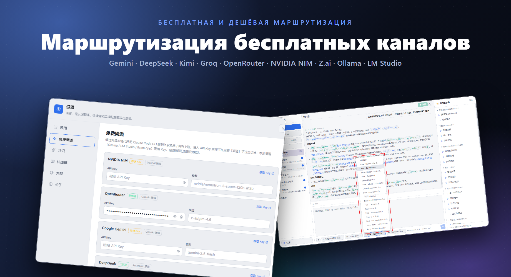
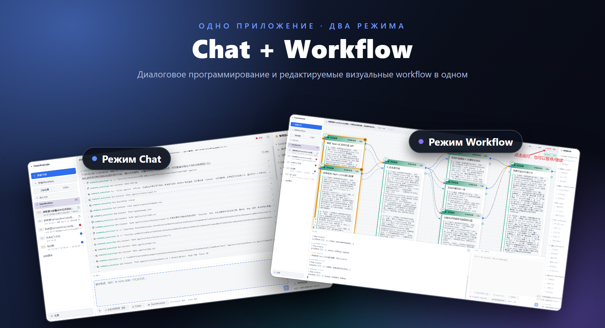

# FreeUltraCode

<div align="center">
  <a href="../../README.md">English</a> | <a href="README.zh-CN.md">中文</a> | <a href="README.fr.md">Français</a> | <a href="README.de.md">Deutsch</a> | <a href="README.es.md">Español</a> | <a href="README.pt-BR.md">Português</a> | Русский | <a href="README.ja.md">日本語</a> | <a href="README.ko.md">한국어</a> | <a href="README.hi.md">हिन्दी</a> | <a href="README.ar.md">العربية</a>
</div>

FreeUltraCode — это десктопное приложение, объединяющее бесплатный чат с ИИ-моделями и визуальный редактор многоагентных рабочих процессов. общайтесь напрямую через 17+ бесплатных каналов (Gemini, DeepSeek, Groq, Ollama…) или строите графы многоагентных workflows на холсте, компилируемые в исполняемые скрипты для Claude Code, Codex, Gemini и других сред выполнения.

<p align="center">
  <strong>Маршрутизация бесплатных каналов</strong><br>
  
</p>

<p align="center">
  <strong>Два режима — Chat и Workflow</strong><br>
  
</p>

## Ключевые возможности

### 🧊 Бесплатный чат с ИИ-моделями
- **17+ бесплатных каналов** встроены — NVIDIA NIM, OpenRouter, Google Gemini, DeepSeek, Mistral, Groq, Cerebras, Fireworks, Kimi, Z.ai, OpenCode, Wafer, а также локальные среды выполнения (Ollama, LM Studio, llama.cpp).
- Встроенный Rust-прокси переводит между протоколами Anthropic и OpenAI, поэтому все каналы работают с одним интерфейсом чата.
- Выберите канал, вставьте API-ключ и начните общение — без дополнительной настройки.
- Локальные среды выполнения (Ollama, LM Studio, llama.cpp) работают **без API-ключа**.

### 🕸️ Визуальный редактор рабочих процессов
- Опишите цель в поле AI-ввода в правом нижнем углу и сгенерируйте редактируемый чертёж Workflow.
- Визуальное создание рабочих процессов вместо ручного редактирования больших многоагентных скриптов.
- Чертёж компилируется в исполняемые скрипты Workflow в стиле Claude Code; скрипты можно загрузить обратно в чертёж.
- Выберите адаптер среды выполнения (Claude Code, Codex, Gemini) и настройте модель для каждого узла.
- Запускайте/останавливайте workflows из десктопного приложения с отслеживанием состояния выполнения каждого узла.

### ⭐ Избранное и история
- Отметьте сеанс звёздочкой, чтобы закрепить его во вкладке **Избранное** для быстрого доступа.
- Вкладка **История** показывает все сеансы с метками: **CHAT** для простых бесед, **WF** для сеансов workflow.
- Полная история рабочих пространств и сеансов — переключение контекста без потери прогресса.

### 🔒 Конфиденциальность прежде всего
- API-ключи хранятся локально на вашем устройстве, никогда не отправляются на сервер.
- Все данные workflows, сеансы и настройки остаются на вашем устройстве.

## Учебное руководство

- [Руководство по использованию FreeUltraCode](claude-code-workflow-freeultracode.ru.md) — пошаговое руководство со снимками экрана от общих настроек и выбора runtime в AI-вводе до генерации чертежа, запуска и переключения оформления.

## Быстрый старт

```bash
cd app
npm install
npm run dev
```

Для настольного приложения:

```bash
cd app
npm run desktop
```

Для сборки релизного пакета под Windows:

```bash
cd app
npm run package
```

Из корня репозитория `run.bat` запускает приложение и пересобирает его при необходимости, а `build.bat` упаковывает установщик для Windows.

## Использование

### Режим чата

1. Нажмите **+ Новый сеанс** в боковой панели.
2. Выберите бесплатный канал (например, Gemini, DeepSeek, Ollama) или используйте свой API-ключ с любой средой выполнения.
3. Введите вопрос в поле ввода внизу. Ответы появятся в области чата сверху.
4. Отметьте сеанс звёздочкой, чтобы закрепить его во вкладке **Избранное**.

### Режим workflow

1. Нажмите **+ Новый workflow** в боковой панели.
2. Опишите задачу в поле AI-ввода в правом нижнем углу. FreeUltraCode автоматически сгенерирует чертёж Workflow.
3. Продолжайте дорабатывать чертёж, вводя последующие инструкции, или щёлкайте распространённые промпты на правой панели.
4. Выбирайте отдельные узлы, когда нужно вручную отредактировать промпты, модели, schema или параметры выполнения.
5. Выберите адаптер среды выполнения, например Claude Code, Codex или Gemini.
6. Нажмите кнопку Run вверху, чтобы выполнить рабочий процесс и наблюдать за обновлениями статуса каждого узла.

## Структура проекта

```text
app/
  src/                 React + TypeScript frontend
    core/              IR, parser, emitter, round-trip logic
    canvas/            React Flow canvas and node components
    panels/            Sidebar (history + favorites), prompt panel, AI dock (chat + workflow), settings (free channels)
    runtime/           DAG execution, provider gateway, run state
    store/             Zustand application state
    lib/
      freeChannels.ts  17+ free channel catalog + helpers
  src-tauri/
    src/
      free_proxy.rs    Rust reverse-proxy + Anthropic↔OpenAI translation
      lib.rs           Tauri commands, filesystem/history bridge
  doc/                 Usage tutorial and screenshots
pencil/                Pencil design files
run.bat                Build-if-needed and launch the Windows app
build.bat              Build the Windows installer
```

## Дополнительная документация

- [README на английском](../../README.md)
- [Руководство по использованию на английском](claude-code-workflow-freeultracode.en.md)

## Проверка

```bash
cd app
npm run typecheck
npm run lint
npm run package
```

## Лицензия

Лицензия пока не указана.
