# FreeUltraCode

<div align="center">
  <a href="../../README.md">English</a> | 中文 | <a href="README.fr.md">Français</a> | <a href="README.de.md">Deutsch</a> | <a href="README.es.md">Español</a> | <a href="README.pt-BR.md">Português</a> | <a href="README.ru.md">Русский</a> | <a href="README.ja.md">日本語</a> | <a href="README.ko.md">한국어</a> | <a href="README.hi.md">हिन्दी</a> | <a href="README.ar.md">العربية</a>
</div>

FreeUltraCode 是一个本地优先的编程工作流工具。它把免费和低成本大模型接入到可编辑的 Dynamic Workflow 里，让多个便宜模型通过多角度探索、对抗验证、方案投票和自适应重试来提高复杂编程任务的准确率，而不是每一步都依赖最贵的模型。

<p align="center">
  <strong>免费渠道路由</strong><br>
  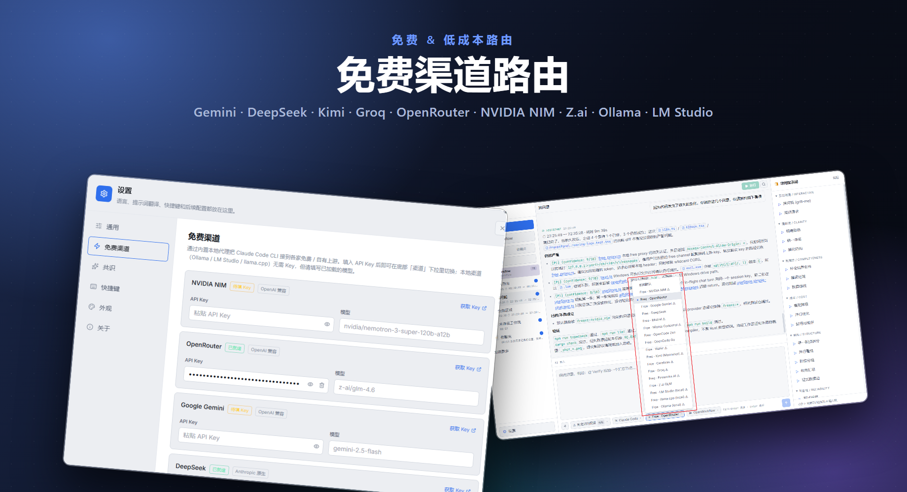
</p>

<p align="center">
  <strong>同时支持 Chat 模式与 Workflow 模式</strong><br>
  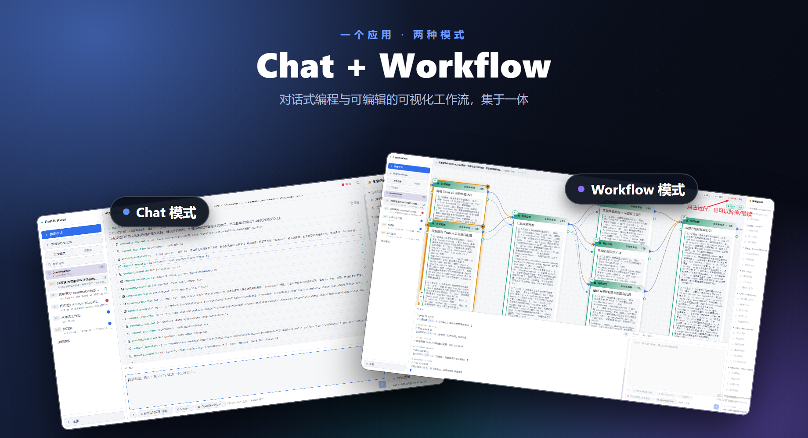
</p>

## 为什么做 FreeUltraCode

Dynamic Workflows 的价值不在于“多叫几个模型”，而在于把一次性回答改造成一个可验证的流程：先拆解需求，再从不同角度探索，随后互相质疑、投票、综合。这个机制对代码审查、迁移、重构、架构判断和复杂 Bug 排查很有用，但如果全部使用高价模型，成本会快速失控。

FreeUltraCode 的目标是把这套机制变得可视、可控、可复用，并尽量降低成本：

- 免费或低成本渠道内置：Gemini、DeepSeek、Kimi、Groq、OpenRouter、NVIDIA NIM、Z.ai、Ollama、LM Studio、llama.cpp 等。
- 简单步骤保持单次调用，复杂或高风险步骤再升级为多样本、多轮校验。
- 支持多角度研究、对抗式验证、锦标赛式方案选择和自一致投票。
- 每个节点可以单独选择运行时、模型等级和渠道，把强模型留给最终判断或高风险节点。
- 工作流图保存在本机，可以检查、编辑、导出、复用。

简言之，FreeUltraCode 不是普通聊天界面，而是把一组便宜模型组织成可执行编程流程的工具。

## 主要能力

### 免费大模型编程聊天

- **17+ 个免费/低成本渠道**：NVIDIA NIM、OpenRouter、Google Gemini、DeepSeek、Mistral、Mistral Codestral、Groq、Cerebras、Fireworks、Kimi、Z.ai、OpenCode、Wafer，以及 Ollama、LM Studio、llama.cpp 等本地运行时。
- 内置 Rust 本地反向代理，自动翻译 Anthropic 和 OpenAI-compatible 协议。
- API Key 只保存在本机。本地模型运行时可以零 API Key 使用。

### 可视化 Dynamic Workflow

- 用自然语言描述编程目标，自动生成可编辑 Workflow 蓝图。
- 在 React Flow 画布上编排 agent、parallel、pipeline、branch、loop、consensus 和 composite 节点。
- 蓝图可编译成 Claude Code 风格 Workflow 脚本，也可以从脚本解析回同一个图模型。
- 在桌面端直接运行工作流，并查看每个节点的执行状态。
- 支持导入/导出 `.fuc.json` 工作流文件。

### 多轮对抗提高准确率

FreeUltraCode 支持几类适合编程任务的质量机制：

| 机制 | 适用场景 | 运行方式 |
| --- | --- | --- |
| 多角度研究 | 需求不清、架构设计、项目迁移 | 多个 agent 从不同视角先调研，再汇总为生成上下文。 |
| 对抗式验证 | 安全审计、代码审查、高风险重构 | 候选结论会被专门反驳，扛住质疑的结论才被保留。 |
| 方案锦标赛 | 多种实现路径可选 | 多个方案分别生成，再由评审选择最佳并吸收其它方案亮点。 |
| 自一致投票 | 结构化判断、确定性决策 | 同一提示运行多次，选择多数一致的结果。 |
| 自适应升级 | 复杂节点、最终校验节点 | 先少量采样，检测分歧；分歧高时再增加样本并投票。 |

### 运行时与模型路由

- 支持 Claude Code、Codex、Gemini 和可扩展 provider routing。
- 可全局配置默认模型，也可给每个节点单独指定模型和渠道。
- Claude Code 可以通过本地 proxy 路由到免费渠道。
- 便宜模型用于探索和草案，强模型用于综合、评审和最终判断。

### 本地优先

- 会话、收藏、历史、API Key、工作流文件都保存在本机。
- 聊天会话和工作流会话统一出现在侧边栏历史中。
- 不依赖托管版 FreeUltraCode 服务。

## 快速开始

从 `app/` 启动 Web 开发版：

```bash
cd app
npm install
npm run dev
```

Vite 默认运行在 <http://localhost:5173>。

启动桌面端开发模式：

```bash
cd app
npm run desktop
```

打包生产版桌面应用：

```bash
cd app
npm run package
```

在仓库根目录下，也可以使用 `run.bat` 自动重建并启动 Windows 应用，或使用 `build.bat` 打包 Windows 安装器。

## 使用方式

### 注册免费渠道

1. 如果希望 Claude Code 通过免费渠道路由访问模型，先在底部运行时菜单里选择 **Claude Code**。

<p align="center">
  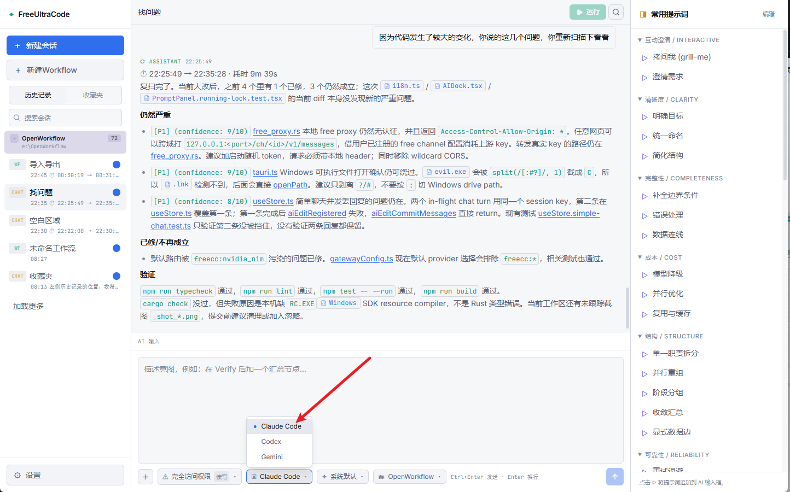
</p>

2. 打开底部渠道菜单，选择一个带警告符号的免费渠道，例如 **Free · OpenRouter**。

<p align="center">
  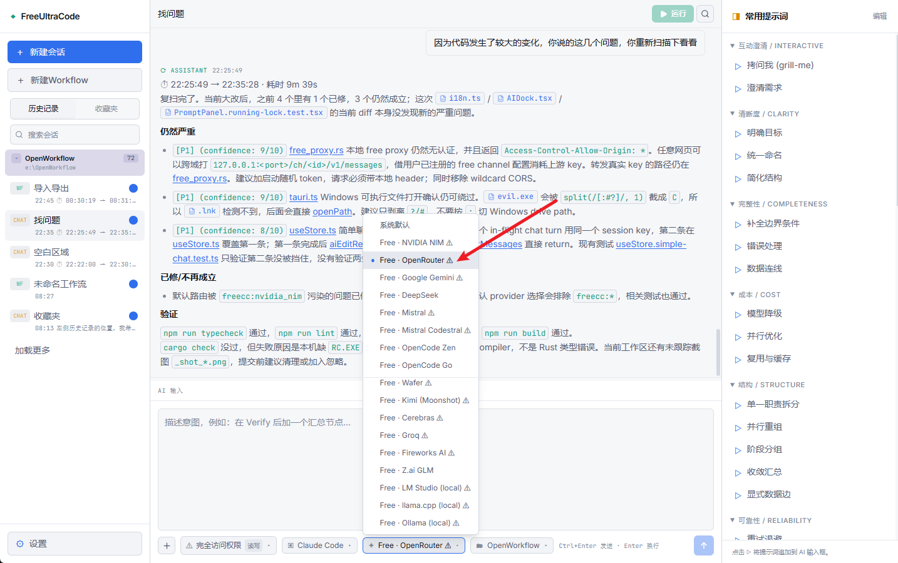
</p>

3. 在弹窗里点击 **打开注册网址**，到平台官网创建 API Key，再粘贴回 FreeUltraCode 并点击 **保存并使用**。

<p align="center">
  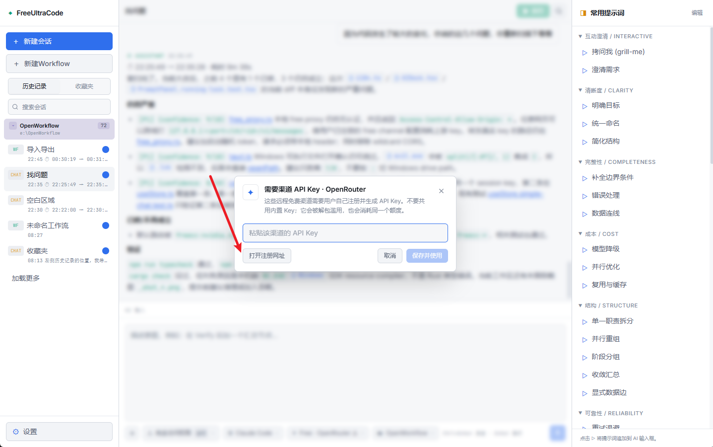
</p>

<p align="center">
  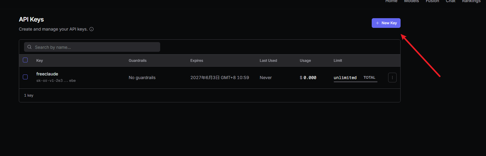
</p>

<p align="center">
  
</p>

4. 也可以从左下角 **设置** 进入 **免费渠道**，集中查看每个渠道的 API Key、默认模型和配置状态。

<p align="center">
  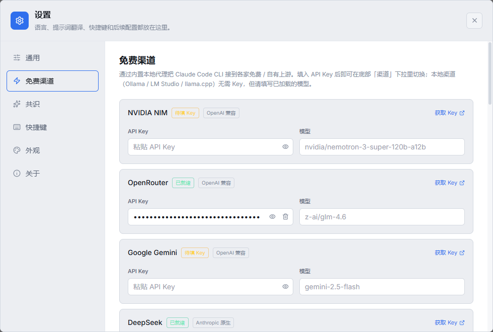
</p>

渠道状态显示 **已就绪** 后，就可以在底部输入框提问，或者运行 workflow。完整步骤见 [注册并配置免费渠道 API Key](register-free-channel.md)。

### 使用 Chat 编程

Chat 模式适合单个明确的编程任务：直接描述要改什么，让 FreeUltraCode 读取项目、修改代码、运行验证，再根据结果继续追问。需要多智能体、投票、对抗审查或可复用流程时，再切换到 Workflow 模式。

1. 点击左侧 **+ 新建会话**，创建一个新的 Chat。
2. 在底部确认运行时、权限模式和工作区。要让 AI 修改代码时，工作区应指向当前要改的仓库；只想先问方案时，可以使用更保守的权限。
3. 在 **AI 输入** 中写清楚编程需求：目标行为、涉及的界面或文件、验收标准、边界条件和限制。写完后按 `Ctrl+Enter`，或点击右下角发送按钮。

<p align="center">
  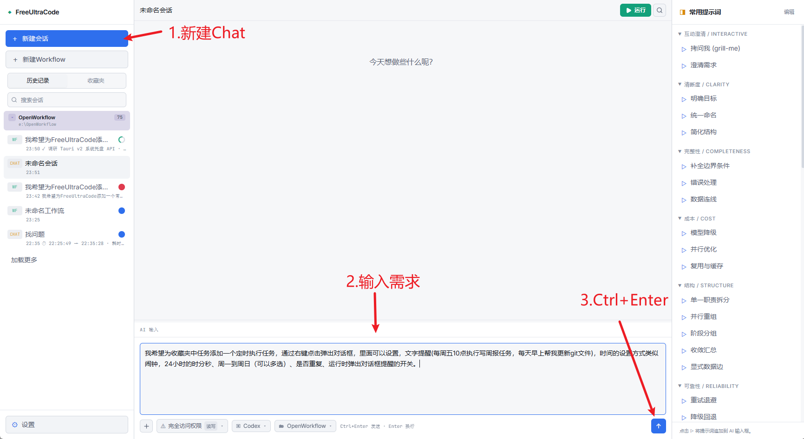
</p>

4. 等待执行时，观察中间区域的消息流和命令记录。FreeUltraCode 会把读取文件、搜索代码、修改文件、运行检查等步骤拆成独立记录，并用状态标记显示是否完成。发现方向不对时，可以点击右上角 **停止**。

<p align="center">
  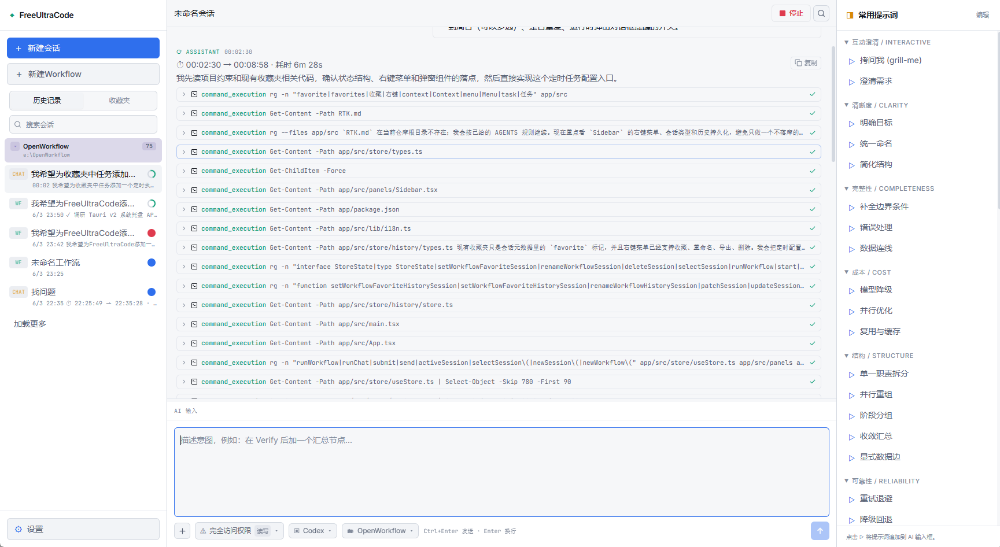
</p>

5. 完成后，先看 AI 的结果总结、改动范围和验证命令。如果还需要调整，直接在同一个 Chat 里继续补充要求；也可以点击右侧 **常用提示词**，让 AI 继续补目标、边界、错误处理、结构、成本或可靠性。
6. 如果是界面功能，最后运行应用实测一次。下面这个例子里，Chat 根据需求给收藏任务增加了定时执行弹窗，并验证了周报提醒、执行时间、重复执行和运行时提醒开关。

<p align="center">
  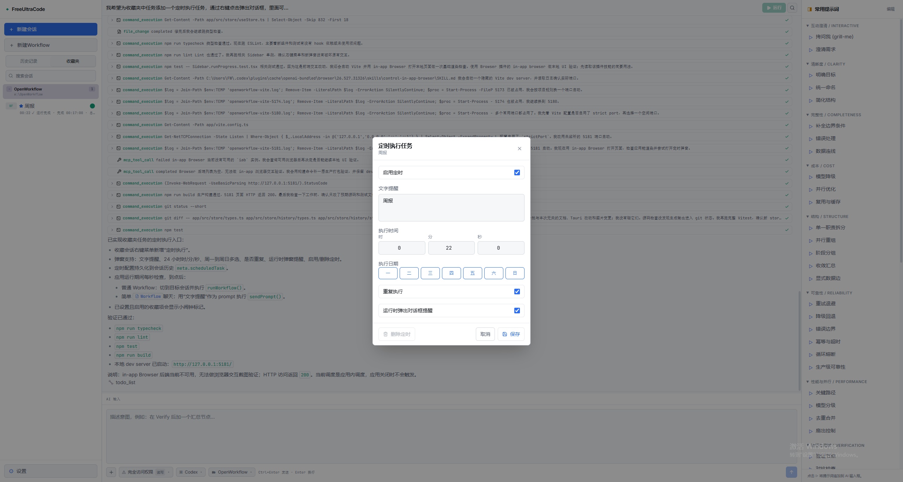
</p>

### 构建编程工作流

1. 点击侧边栏 **+ New Workflow** 新建工作流。画布会先生成一个最小流程：**Start → 智能体 → End**。

<p align="center">
  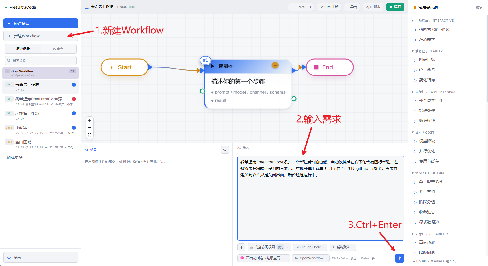
</p>

2. 在底部 **AI 输入** 区写清楚编程需求，例如功能目标、交互方式、验收标准、边界条件和需要注意的文件。写完后按 `Ctrl+Enter`，或点击右下角发送按钮。
3. FreeUltraCode 会把自然语言需求生成成可编辑的 Workflow 蓝图。蓝图底层是可运行的 JS 脚本，节点之间的连线表示执行顺序、并行分支、投票和汇总关系。

<p align="center">
  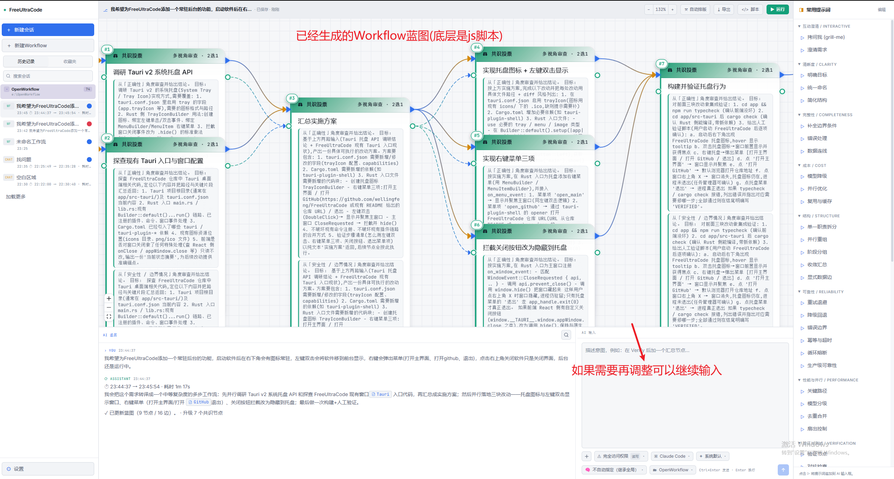
</p>

4. 如果蓝图还不够准确，可以继续在底部输入框补充要求，也可以点击右侧 **常用提示词**，让 AI 继续补目标、边界、错误处理、数据流、成本优化、并行结构、回退策略和验证节点。
5. 选中关键节点后，在右侧检查或修改提示词、schema、模型、provider、样本数和执行参数。高风险步骤可以改成 **Consensus**，让多个样本从不同角度审查、投票或汇总。
6. 点击顶部 **运行** 开始执行。运行中节点会高亮并显示状态，底部会输出节点日志和 AI 返回；输入区会进入只读状态。需要中断时，点击顶部 **运行中...停止**，停止后可以继续修改蓝图再运行。

<p align="center">
  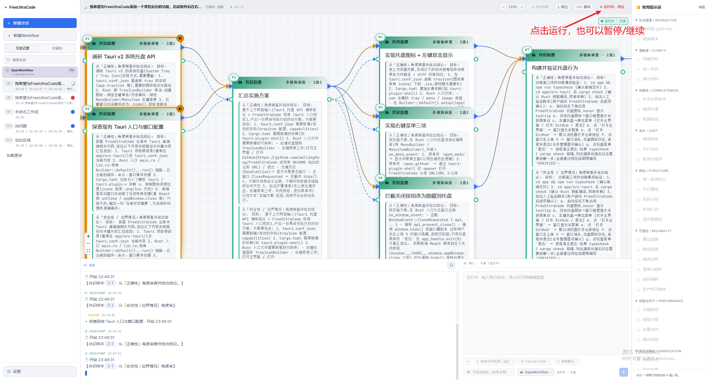
</p>

7. 在桌面端，关闭主窗口不等于退出应用。FreeUltraCode 会驻留在 Windows 托盘，右键托盘图标可以 **打开主界面**、**打开 GitHub** 或 **退出**；需要让后台继续运行时，保持托盘进程即可。

<p align="center">
  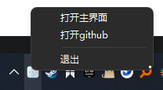
</p>

## CLI 预览

CLI 暴露两个用户命令：

- `fuc gen`：根据自然语言生成或修改 Workflow 脚本。
- `fuc run`：运行 Workflow 脚本，支持 dry-run 和 resume。

如果 `app/cli/dist/fuc.mjs` 不存在，先构建 CLI：

```bash
cd app
npm run cli:build
```

然后从仓库根目录运行：

```bash
node app/cli/dist/fuc.mjs gen "Create a code-review workflow" -o review.js
node app/cli/dist/fuc.mjs run review.js --dry-run
```

更多信息见 [FreeUltraCode CLI usage](freeultracode-cli-usage.md) 和 [CLI skill spec](freeultracode-cli-skill-spec.md)。

## 工作原理

`IRGraph` 是系统唯一事实源。画布、解析器、生成器、AI 改图、运行时和本地持久化都围绕同一个模型无关图结构工作。

```text
编程目标
    |
    +-- 聊天模式 ------> simpleBlueprint -> 单节点 IRGraph -> 免费渠道 proxy -> 回答
    |
    +-- 工作流模式 ----> 多角度研究 -> 蓝图共识生成 -> IRGraph -> React Flow 画布
                                                              |
                                                              +--> emitter -> 可运行 Workflow 脚本
                                                              |
                                                              +--> parser  -> 脚本往返恢复图
                                                              |
                                                              +--> runtime -> Claude Code / Codex / Gemini
                                                                            |
                                                                            +--> consensus / 投票 / 重试
```

免费渠道 proxy：

- 只绑定 `127.0.0.1:<port>`。
- 每个渠道通过 `http://127.0.0.1:<port>/ch/<channelId>` 路由。
- 翻译 Anthropic 和 OpenAI-compatible 流式协议。
- 让 Claude Code 也能通过同一条 gateway 路径使用非 Anthropic 或本地 provider。

## 技术栈

| 范围 | 技术 |
| --- | --- |
| 桌面壳 | Tauri 2, Rust |
| 前端 | React 18, Vite 5, TypeScript 5 |
| 画布 | React Flow / `@xyflow/react` |
| 状态 | Zustand |
| 样式 | Tailwind CSS, CSS variables |
| 图标 | lucide-react |
| Workflow 核心 | `IRGraph`、parser、emitter、round-trip checks |
| 运行时 | DAG 执行、provider gateway、节点状态、consensus runner |
| 免费渠道 proxy | Rust `tiny_http` + `ureq`，Anthropic/OpenAI 协议翻译 |
| 运行时适配器 | Claude Code、Codex、Gemini、可扩展 provider routing |

## 项目结构

```text
app/
  src/
    core/        IR、parser、emitter、fixtures、consensus heuristic、round-trip checks
    canvas/      React Flow 投影、节点组件、toolbar
    panels/      Sidebar、prompt panel、AI dock、node inspector、settings
    runtime/     DAG 执行、provider gateway、consensus、运行状态
    store/       Zustand 状态和历史
    lib/
      freeChannels.ts  17+ 免费渠道目录和辅助函数
  src-tauri/
    src/
      free_proxy.rs    Rust 反向代理 + Anthropic/OpenAI 协议翻译
      lib.rs           Tauri 命令、文件系统/历史桥接
  doc/                 教程、本地化 README、CLI 文档、截图
docs/                  调研笔记、静态文档、素材
pencil/                Pencil 设计文件
```

## 相关文档

- [FreeUltraCode 使用教程](claude-code-workflow-freeultracode.md)
- [注册并配置免费渠道 API Key](register-free-channel.md)
- [英文使用教程](claude-code-workflow-freeultracode.en.md)
- [FreeUltraCode CLI usage](freeultracode-cli-usage.md)
- [FreeUltraCode CLI skill spec](freeultracode-cli-skill-spec.md)
- [Workflow syntax reference](../../docs/workflow-syntax-reference.html)
- [英文 README](../../README.md)

## 开发与验证

从 `app/` 运行：

```bash
npm run dev        # Vite 开发服务器
npm run typecheck  # TypeScript 检查
npm run lint       # ESLint
npm run test       # Vitest
npm run desktop    # Tauri 开发模式
npm run package    # 生产打包
```

如果修改 parser、emitter 或 IR，请运行应用，并在浏览器控制台使用：

```js
FreeUltraCode.roundtrip()
FreeUltraCode.roundtripAll()
```

## 社区

- Discord: <https://discord.gg/2C9ptSEFG>
- QQ Group: `149523963`
- Issues: <https://github.com/wellingfeng/FreeUltraCode/issues>
- Repository: <https://github.com/wellingfeng/FreeUltraCode>

PR 应描述行为变化、列出验证命令、关联 issue，并在 UI 变化时附截图或短录屏。

## 许可证

目前尚未指定许可证。
