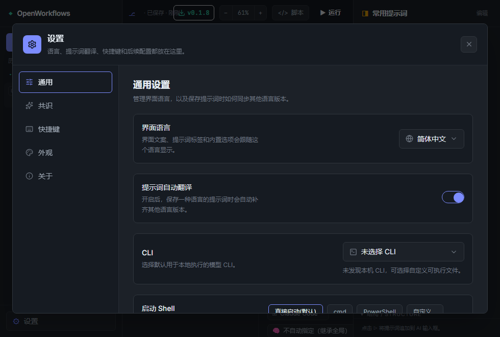

# Claude Code Has Workflows. What About Other Models? I Tried OpenWorkflows

Recently I have been looking closely at Claude Code workflows.

What interests me is not just "another feature." It pulls complex work out of one chat turn after another. Tasks can be split into subagents, parallel branches, and pipelines, then coordinated by scripts.

That matters because a workflow is no longer a temporary arrangement inside one conversation. It becomes something you can save, edit, and reuse.

That also raised a question for me: if workflows are becoming a common layer in AI coding, why should they be tied to one model or one CLI?

So I tried OpenWorkflows. It turns Claude Code-style workflows into a visual canvas, and it tries to make the same workflow target Claude Code, Codex, Gemini, and more local or cloud runtimes.

This tutorial does not start with abstract concepts. It walks through the screenshots in order. The example is concrete: make OpenWorkflows support multiple appearance themes, default to Pencil, and allow switching in Settings / Appearance.

> This is the English version of the screenshot-based usage tutorial.
>
> Chinese version: [OpenWorkflows 使用教程](claude-code-workflow-openworkflow.md)

## 0. Start with the final interface

<p align="center">
  
</p>
<p align="center"><em>Figure 0: The main OpenWorkflows workspace, with the blueprint in the center, node properties on the right, and AI input and output at the bottom.</em></p>

The main UI has four parts: workflow history on the left, the visual canvas in the center, node properties and common prompts on the right, and AI input plus response panels at the bottom.

The workflow in the screenshot is titled "Pencil multi-theme appearance plan." It is not a static diagram. It is a workflow you can keep editing, turn into a script, run, and revisit later.

## 1. Download OpenWorkflows

<p align="center">
  
</p>
<p align="center"><em>Figure 1: Find the latest build from the Releases section on the GitHub page.</em></p>

The fastest way to try it is to open the GitHub project page and download the latest release from Releases.

The About panel on the right makes the positioning clear. This is a visual editor that extends Claude Code Workflows to Codex, Gemini, and more LLM runtimes.

If you want to work on the code, clone the repo and start from the `app/` directory:

```bash
npm install
npm run dev
```

For the desktop app, use:

```bash
npm run desktop
```

## 2. Confirm general settings and the run entry point

<p align="center">
  
</p>
<p align="center"><em>Figure 2: Configure language, local CLI, and launch shell in Settings / General; choose the active run model / channel at the bottom of AI Input.</em></p>

Before drawing anything, open **Settings / General**. This is where you configure the UI language, prompt auto-translation, local CLI, and launch shell.

The old **Models** tab has been removed. The active model or channel is no longer configured in Settings; choose it for the current request from the runtime dropdown at the bottom of AI Input.

If a specific node needs a different model, select the node and override the model in Node Properties. When left empty, the node inherits the workflow or global selection.

## 3. Create a new workflow and enter a request

<p align="center">
  
</p>
<p align="center"><em>Figure 3: Click New Workflow, then describe the workflow in the bottom-right AI input.</em></p>

After confirming the general settings and runtime entry point, click **New Workflow** on the left. The canvas starts with a minimal structure: Start, one Agent, and End.

The real starting point is not manual node drawing. It is the AI input in the bottom-right corner. In this example, I typed:

```text
I want OpenWorkflows to support multiple appearance themes,
default to Pencil,
and allow switching them in Settings / Appearance.
```

After you send it with `Ctrl+Enter`, or by clicking the send button, OpenWorkflows turns the request into an editable workflow blueprint.

## 4-1. Generate the workflow blueprint

<p align="center">
  
</p>
<p align="center"><em>Figure 4-1: The AI splits the goal into parallel branches, a summary node, implementation nodes, validation, and delivery.</em></p>

Once the request is sent, OpenWorkflows rewrites the current step into a complete workflow.

The blueprint in the screenshot roughly becomes:

```text
Start
  -> Explore appearance support in parallel
      -> Research current entry points
      -> Design the theme system
      -> Design the Pencil default theme
  -> Summarize the implementation plan
  -> Implement multi-theme appearance
  -> Connect Settings / Appearance switching
  -> Validate and review
  -> Record delivery results
  -> End
```

What matters here is not how pretty the graph looks. It is that a fuzzy goal becomes an executable plan.

The node properties panel on the right still lets you inspect labels, types, branches, agent types, and schemas. Generation does not lock you out of editing the structure.

## 4-2. View the generated script

<p align="center">
  
</p>
<p align="center"><em>Figure 4-2: Use the Script button to inspect the workflow script generated from the canvas.</em></p>

There is a **Script** button in the top bar. Open it and you will see the script generated from the current blueprint.

In the screenshot, you can see `parallel(...)` and `agent(...)` structures. Parallel nodes become concurrent branches, and regular nodes become individual agent calls.

This shows that OpenWorkflows is not just drawing boxes. The canvas is backed by a shared workflow structure that can later target different runtimes.

## 5. Keep refining with common prompts

<p align="center">
  
</p>
<p align="center"><em>Figure 5: Common prompts push typical workflow edits into the AI input area.</em></p>

After the blueprint is generated, you do not have to run it immediately. The **Common Prompts** panel on the right is better for refining the flow.

The prompts are grouped by scenario: clarification, clarity, completeness, cost, structure, reliability, performance and parallelism, and verification.

The screenshot shows the **Clarify Request** prompt. It fills the AI input with a request to confirm key ambiguities before changing the graph.

That is useful because many workflow failures are not model failures. They happen because the goal, boundaries, failure paths, or cost strategy were never stated clearly enough.

## 6. Confirm boundaries with interactive choices

<p align="center">
  
</p>
<p align="center"><em>Figure 6: When the request is ambiguous, the AI offers choices so you can confirm the scope first.</em></p>

After choosing **Clarify Request**, the AI does not change the graph right away. Instead, it asks a follow-up question: how far should theme switching go?

The screenshot offers two choices: only ship the Pencil default theme and leave expansion structure in place, or ship Pencil plus multiple switchable themes.

Once you choose, the AI writes that decision back into the workflow blueprint and outputs the updated IRGraph. That reduces the risk of the AI taking the workflow in the wrong direction on its own.

## 7. Click Run

<p align="center">
  
</p>
<p align="center"><em>Figure 7: After the blueprint is ready, click Run in the top bar.</em></p>

After the structure, runtime selection, and key boundaries are confirmed, click **Run**.

It is better not to run the workflow the moment it is generated. First check whether the parallel branches make sense, whether the summary node comes after the branches, and whether validation covers the final result.

If a node is only unclear in responsibility, you can edit its label, prompt, agent type, or schema before running again.

## 8. Watch the running state

<p align="center">
  
</p>
<p align="center"><em>Figure 8: While running, the button changes to "Running... Stop", and each node shows its state.</em></p>

When the workflow starts, the top button changes to **Running... Stop**. The AI input at the bottom is locked so the blueprint does not change mid-run.

The canvas shows node status directly. In the screenshot, Start has completed, the parallel node is still running, and the top-right counter shows execution progress.

That is more readable than a long log. If something fails, you do not need to throw away the whole prompt. You can find the failing node and adjust only that node's prompt, model, or input.

## 9. Switch the appearance theme

<p align="center">
  
</p>
<p align="center"><em>Figure 9: The final feature lands in Settings / Appearance, where you can choose Pencil, Deep Night, Aurora, Daylight, Ember, and more.</em></p>

The goal of this example is to let OpenWorkflows support multiple appearance themes. The final entry point is **Settings / Appearance**.

The screenshot shows theme cards such as Pencil, Deep Night, Aurora, Daylight, and Ember. When you pick one, it changes the global background, panels, borders, and run-state colors.

That also shows the real use case here. OpenWorkflows is not only for demo diagrams. It can break a product request into research, design, implementation, validation, and delivery tracking, then push each piece through the right node.

## What I think is actually useful

OpenWorkflows is valuable for more than wrapping a prompt in a UI.

It connects request, blueprint, script, execution, and history review. You can generate a flow in natural language, inspect the structure on the canvas, use common prompts to tighten the boundaries, and only then run it.

A workflow also does not have to be tied to one model. Simple nodes can use cheaper models, important nodes can use stronger ones, and the execution target can still expand to Claude Code, Codex, Gemini, or other runtimes.

For complex AI coding tasks, that structure is much easier to maintain than one huge prompt. If one node fails, fix that node. If one branch is unnecessary, remove it. If you want reuse, continue from history.

## How this relates to Claude Code

OpenWorkflows does not look like a replacement for Claude Code.

Claude Code already made the workflow direction clear: complex work can be written as dynamic scripts, coordinated across multiple subagents, and run in the background.

OpenWorkflows adds a visual layer to that direction: draw the workflow, edit it, save it, and then try the same structure against more models and runtimes.

So it is not going against Claude Code. It is extending the workflow idea outward.

## Still early, but worth watching

OpenWorkflows is not mature yet. Runtime adapters, node capabilities, and the script ecosystem will keep changing.

But the direction is clear. AI coding will not stay at "open a chat box and manually push every step" forever.

Eventually, complex tasks will become workflows. The only real question is whether that workflow stays locked inside one tool, or whether it can be seen, edited, migrated, and reused.

Project:

https://github.com/wellingfeng/OpenWorkflows

Reference:

https://code.claude.com/docs/en/workflows
